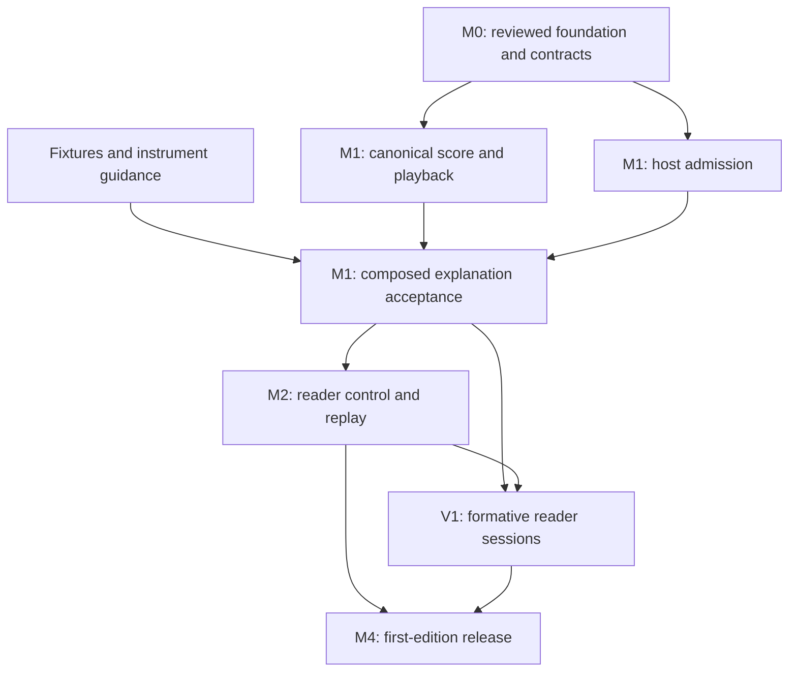

# RISE roadmap: a reader-controlled first edition

Date: 2026-10-03

Status: product direction approved; delivery roadmap. Milestones below are proposed work, not completed features.

Updated 2026-10-04: [Composer is the decided approach](product/discussions/2026-10-04-composer-decision.md). Composer is a one-shot sequence creator and RISE presentation within ChatGPT. Dive (follow-up questions and model-authored Dive notes) and realtime Live are out of current scope; M3 and the Live research track are removed below.

Revised 2026-10-09: the product line is Reader, Composer and Live; Claude is the first and current host, and ChatGPT comes last; Creative Control, voice hardening and the playback instrument shipped; the Feelings sounds are parked. The milestones below keep their 2026-10-03 text with dated amendments. [Revised 2026-10-09](#revised-2026-10-09-where-the-composer-edition-stands) states the current position, and [Immediate execution order](#immediate-execution-order) the critical path from here.

## Product promise and scope

**Turn an answer into a coherent audiovisual experience, composed in one shot and presented by RISE under the reader's control.**

The first edition serves one job: a short guided explanation. The model composes an admitted score before playback. RISE performs it with immediate reader controls. A reader can begin, interrupt, resume, stop and adjust the visual without losing their place; asking the model a follow-up inside the presentation is out of scope. The first supported provider host is ChatGPT; the same score and playback path must remain usable locally.

*Amended 2026-10-09:* the first supported host is Claude. The owner, 2026-10-08: "We will focus on Claude first as the Provider … only at the end … integrating onto GPT." ChatGPT follows the Composer release in Claude: first the sandbox measurement (CC-001), then the minimal-transport ChatGPT edition.

This roadmap changes the release sequence of the October Live roadmap. Composition is a product mode with its own character, not a temporary imitation of Live. The ChatGPT host session of 2026-10-04 showed that a model's later tool calls do not reach an open widget, so model-driven mutation during an utterance is deferred rather than researched in parallel.

This is a milestone and ownership roadmap. Each engineering work package needs a narrow implementation plan against its actual starting commit before coding. It does not authorize deployment, public exposure or rewriting shared branches.

### Requirements and what earns its place

| Requirement | Who needs it and why |
|---|---|
| Coherent composition | Readers need a meaningful relationship between explanation, pacing and presentation. |
| Immediate local control | Readers need to pause, stop and adjust the experience without waiting for a model. |
| One durable score | Contributors need reproducible composition, validation and replay across hosts. |
| Reliable host admission | Readers must not begin an experience the server refused. |
| Small, governed instrument set | Models need choices they can use correctly; readers need comprehensible, accessible output. |

Remove realtime mutation and Dive from the current scope. Defer broad renderer expansion, a new event protocol, scenes, generated renderer execution, public SDK commitments and additional hosts. Preserve existing admission, reader-owned AI and applicable release requirements. Existing canonical-source publication gates in [the earlier release ledger](RELEASE-ROADMAP-2026-08-20.md) remain in force for those reading experiences; this explanation edition does not certify them.

*Amended 2026-10-09:* the deferral of scenes and generated renderer execution is superseded. The owner approved the [Creative Control design](superpowers/specs/2026-10-08-creative-control-design.md) on 2026-10-08, and it shipped as CC-002 to CC-008: beats, typography and maths, native engine manifests and cues, generated scenes in a sandboxed worker, their admission, styles and `rise_guide`, and the provisional RiseSDK renderer contract. Realtime mutation, Dive and additional hosts stay out of the Composer edition.

## Starting position

The latest assessment recorded main at `38332c468be98e8dffd671304e3076db06cdc758`, repair [PR #371](https://github.com/SyberLabs/RISE/pull/371) at `8819564483491f584c1d312b8fba10132ac8e61f`, and experiment [PR #372](https://github.com/SyberLabs/RISE/pull/372) at `65c1824fbeda95289c652368816be47d2cf590c4`. These are assessment references, not a claim that remote heads remain unchanged.

- Main and the repair candidate have diverged. Their integration needs an integrity review and fresh verification.
- The candidate repairs admission/Begin ordering, theme regressions and bounded visual handling. Its test results certify that candidate, not a future integrated release.
- An earlier ChatGPT Composer demonstration produced narration the reader confirmed hearing. Exact-release acceptance remains required.
- The original Gate 0 trial delivered mutations into separate widgets. The decoupled probe's real-host trial (2026-10-04) kept one widget, but admitted model changes never reached it without a manual read. ChatGPT is a Composer host.
- The canonical score/compiler/Player path exists. Some Live presentation changes and reader controls still lack durable score representation.
- Catalog foundations exist. The first edition needs a curated useful subset, not a larger inventory.
- The [evaluation instrument](plans/LIVE-EVALUATION.md) exists; its study has not run.

## Architecture and working agreements

Use the existing Experience Program as the durable score, Current as an adapter, Session as the compiled presentation, Player as the playback clock, and Chamber as the stage. Do not create another runtime or persistence store.

Retain authored meaning and reader-authorized presentation changes where the score vocabulary represents them. Keep speech marks, transport receipts and observations as evidence. Replay means reproducing admitted content and presentation intent; it does not promise identical browser voices or sample-exact audio.

The first edition accepts no model changes after admission: one Current is composed, admitted and presented. A general event reducer and active-cue mutation system are not prerequisites.

Before independent coding begins, record the shared contract in one short design document: score fixture and validation boundary; successful/refused host result; reader-control authority; pause/resume position. Reuse existing interfaces wherever possible. Any required interface change has one owner and must be reviewed before consumers depend on it.

## Milestones and dependencies

### M0 — establish a trustworthy foundation

Owner: coordinator. Dependency: none.

- [ ] Refresh main and both draft heads; inventory repairs versus changes already landed.
- [ ] Reconcile the repair foundation with current main without losing themes, reader controls or admission checks.
- [ ] Regenerate the architecture diagram and run required CI and the production browser gate against the integrated commit.
- [ ] Review rebase integrity, unresolved findings and remaining test limitations; record the exact foundation commit.
- [ ] Freeze the minimal Composer contract described above.

**Exit:** a reviewed foundation and shared contract that downstream branches can consume. Current candidate verification alone does not close this milestone.

**Parallel now:** prepare explanation fixtures, interview protocol and instrument guidance. Production integration remains with the coordinator.

### M1 — deliver one complete composed explanation

Owners: score/playback agent, host/admission agent, experience-design agent. Dependencies: M0 for integration; content and test preparation can start sooner.

- [ ] Prove parity for the first-edition path from Current to Experience Program to compiled playback, preserving text, source anchors, themes and supported visual intent.
- [ ] Make model proposals, server admission and reader Begin distinct states. Refusals, malformed results and late results must leave accepted state safe.
- [ ] Demonstrate one explanation locally and in ChatGPT, using the same admitted semantics.
- [ ] Curate at most three existing instruments supported by the chosen playback surface. Document purpose, parameters, limits, accessibility and whether each is explanatory or atmospheric. Do not expose Neural as a Current/control instrument without separate admission work.
- [ ] Provide three short explanation fixtures with different presentation demands. The black-hole fixture remains one example rather than the sole test of the medium.

**Exit:** an end-to-end experience whose purpose is apparent on the first use, with exact-head audible and visual host acceptance recorded. Text remains usable when speech is unavailable, with an explicit visible state.

*Amended 2026-10-09:* the code is deployed (LIVE-001 to LIVE-003 done; LIVE-004 deployed, in review). Acceptance moves to Claude: the owner's explicit witness decision on LIVE-004, after the first-chat card defect (LIVE-016).

**Parallel:** core parity and Worker admission can be implemented separately after the contract is fixed. Instrument writing and fixtures can proceed alongside them. Changes to shared manifests/compilers stay with the score owner.

### M2 — make the experience reader-controlled

Owners: reader-experience agent and score/playback owner. Dependencies: M1 playable slice and M0 control/position contract.

- [ ] Make Begin, pause, resume and Stop predictable; Stop cancels pending speech and future playback work.
- [ ] Retain existing useful local pace and bounded visual controls. Document which are session preferences and which change durable presentation intent.
- [ ] Preserve place through pause/resume and reader navigation. Late callbacks must not restart stopped or replaced playback.
- [ ] Ensure controls are reachable on phone widths, usable by keyboard and compatible with reduced motion.
- [ ] Save/export the admitted explanation through existing interchange/Vault machinery and verify replay semantics.

**Exit:** the reader can complete, interrupt, resume and revisit an explanation without losing orientation. Reader changes survive replay when promised; transient preferences are identified accurately.

*Amended 2026-10-09:* M2 is built in the card and deployed (LIVE-005), and the card gained a full transport: seek, replay, pace and full screen with the voice moving first (PLY-001: #549, #551, #553). Both are in review for the owner's witness in Claude.

**Parallel:** UI accessibility work can use a fixed score fixture while core persistence is implemented. Shared runtime or Player edits must be serialized under their owner.

### V1 — test the product before expanding it

Owner: coordinator with human participants. Dependencies: M1 for initial observations; M2 for the full control experience.

- [ ] Conduct an initial round of five exploratory sessions using the short explanations. This is formative research, not a powered efficacy study.
- [ ] Observe whether readers understand the purpose, finish a passage, explain the role of the visuals, interrupt and resume, and choose another experience.
- [ ] Record confusion, startup friction, atmosphere/preferences and comprehension separately. Do not convert novelty or preference into a learning claim.
- [ ] Make a written continue/change/stop decision: fix blocking usability problems, narrow the experience if necessary, and expand only where observed behavior supports it.

**Exit:** a specific reader benefit and a usable flow, supported by observations. If there is no clear benefit, revise composition and interaction before adding transport or renderer complexity.

**Parallel:** prepare the release evidence plan. Follow-up machinery is out of scope.

*Amended 2026-10-09:* not started. The reader-session protocol for LIVE-006 is still to be written; the sessions run in Claude.

### M3 — removed

Exploration and return (a reader question, an admitted follow-up, a return to the original) was removed from scope on 2026-10-04 with Dive. Milestone numbering is kept so earlier references stay readable.

### M4 — release the first edition

Owner: coordinator. Dependencies: M0–M2, V1, and applicable security/distribution gates.

- [ ] Complete review and required CI on the exact release commit; record browser, speech, admission, cancellation and replay evidence.
- [ ] Witness the supported desktop and phone experience on real devices; distinguish emulation from device acceptance.
- [ ] Check reader-owned AI boundaries, production CSP/resources, accessible failure states and absence of inference credentials in widget/client output.
- [ ] Write onboarding and limitations around Composer: one composed explanation per answer, presented under the reader's control.
- [ ] Prepare deployment/rollback and temporary-exposure shutdown steps; publish only through the authorized release process.

**Exit:** a small reliable edition with a clear promise, known supported environments and an exact-release evidence record. Unproven Live claims must not appear in release copy.

*Amended 2026-10-09:* M4 releases the Composer edition in Claude (LIVE-009). The ChatGPT edition follows it: CC-001 measures ChatGPT's sandbox, then the minimal transport ships there.

## Live in ChatGPT: decided

The decoupled host probe ran once, within its two-session budget, on 2026-10-04. Reader changes applied in one persistent widget; admitted model changes did not reach it without a manual read; Voice interleaving was not shown. ChatGPT is a Composer host, #372 is closed, and no ChatGPT-specific Live plumbing is planned. A future Live needs a host RISE owns and a concrete reader benefit to test; see the [decision](product/discussions/2026-10-04-composer-decision.md).

*Amended 2026-10-09:* that future Live is named (see below): RISE LIVE, the third product, after the Composer release gate.

## Revised 2026-10-09: where the Composer edition stands

### The product line

Three products, in this order:

1. **Reader:** RISE's own site, reading canonical texts.
2. **Composer:** a host model composes one sealed Current, the Worker admits it, and RISE presents it under the reader's control. This roadmap.
3. **Live:** "RISE LIVE", named by the owner on 2026-10-08 as the third product. RISE controls the whole environment through coordinated voice streaming and realtime response, so that the host does not own the venue; it may host interactive scenes more naturally. Its first design question is the one-clock rule ([VISION §2.7](VISION.md)). Not scheduled before the Composer release gate (LIVE-017).

### Host order

Claude is the first and current host. ChatGPT comes last: the sandbox measurement (CC-001), then the minimal-transport ChatGPT edition. The owner, 2026-10-08: "We will focus on Claude first as the Provider … only at the end … integrating onto GPT."

### What shipped since 2026-10-04

Every item below is merged and in the live release (rise.syberlabs.io/release.txt read `3b43a3be` on 2026-10-09). Shipped is not accepted: the human gates stay open on each task.

- **Creative Control** (CC-002 to CC-008, #517 to #523; [design](superpowers/specs/2026-10-08-creative-control-design.md)): beats (`rise.current.v2`), typography, placement and maths, native engine manifests and cues, generated scenes in a sandboxed worker on an OffscreenCanvas with budgets and a kill switch, their admission and diagnostics, styles and `rise_guide`, and the provisional [RiseSDK contract](specs/RISE-SDK.md).
- **The look on the Current** (SCR-002 #504, SCR-003 #506). The stage 1b fields (collection and sourced stills, pace) and the curator-context resource are not built.
- **Voice hardening** (SPK-004): #515, then voice hardening 2, #535.
- **The playback instrument** (PLY-001): seek, replay, pace and full screen with the voice moving first, #549, #551, #553.
- **The Feelings sounds parked** (#558, #562): the eleven are removed from every list, look, Current and guide until they are reworked ([record](product/discussions/2026-10-09-feelings-sounds-parked.md)).

### What the owner observed

In Claude on the deployed build, 2026-10-09, after #535 and the playback instrument: "Beautiful!! Much more robust and working well on the voice side. Card behavior still needs further testing from brand new sessions." and "very good. seems to be working wonderfully! Fullscreen esp is a step up." These are observations, not acceptance. LIVE-004, LIVE-005 and PLY-001 stay in review until the owner gives an explicit witness decision. The card's first-chat-of-the-day failure (the card does not appear until a reload on the first new RISE chat of the day) is open as LIVE-016.

### Plus

A Plus lane is being built by sdcarlson outside this roadmap: Stripe purchase, Plus voices and canon recitation. Merged so far: #541, #542, #552, #555, #556, #561, #563, #566. SPK-005 records the administrator and paid voice budget. How Plus relates to the Composer edition is the owner's decision.

## Dependency map

M1 is integration of parallel work, not three independent claims of product completion.

## Agent ownership and dispatch order

With four concurrent slots, use a coordinator and at most three active agents. Start coding agents only after the foundation/contract they consume is available. Use LUNA at medium or high effort for implementation, as requested; give each a separate worktree, a `codex/` branch and one narrow PR.

| Lane | Owns | Starts | Must not change |
|---|---|---|---|
| Coordinator | M0, real-host acceptance, integration, release and evidence | Immediately | No unreviewed shared branch rewrite |
| Score/playback agent | Canonical parity, manifests, durable intent, replay; narrowly required compiler/Player work | After M0; read-only assessment earlier | Worker, provider transport, deployment |
| Host/admission agent | `worker/*` and its tests; the admitted/refused Current boundary | After M0 contract | Core compiler/Player and reader UI |
| Experience agent | Fixtures/instrument guidance first; reader UI and controls after contracts | Preparation immediately | Worker, manifests, shared runtime/Player without coordination |

The coordinator retains widget/MCP bridge integration, `.github/workflows/*`, Wrangler configuration, lockfile and production verification. The experience agent can own UI components but cannot concurrently edit shared playback or bridge files. When one agent finishes, reuse its slot for read-only review or a narrowly scoped next task; do not create a second infrastructure lane.

Contract changes pause affected consumers until agreed. Independent investigations can continue. Integrate one reviewed PR at a time through required CI, then verify the assembled behavior rather than treating isolated green tests as integration evidence.

## Effect on earlier assignments and the larger roadmap

This roadmap supersedes the release sequence and long-horizon scope in [the earlier parallel assignment](superpowers/handoffs/2026-10-03-parallel-roadmap-assignment.md). Retain its semantic-convergence work and source-coordinate discipline. Defer its general temporal reducer and three-stage mutation demonstration; they are conditional Live work rather than first-edition prerequisites. Preserve earlier handoffs and trial records as historical evidence.

After the first edition earns use, prioritize by the observed limitation:

- Composition limitations → better authoring vocabulary and instruments.
- Readers asking to question the explanation → reconsider Dive as its own decision.
- Proven need for continuous adaptation → a host RISE owns, canonical events and temporal authority, then a reciprocal Live demonstration.
- Voice quality/timing limitations → a measured voice-clock improvement.
- Repeated external integration demand → scenes, SDK stabilization and additional hosts.

These are evidence-triggered options, not an automatic platform backlog.

## Immediate execution order

Revised 2026-10-09. The critical path to the Composer release, in order:

1. **LIVE-016:** the card on the first chat of the day. Reproduce it with the owner in a brand-new chat, name the root cause, then fix it or report it to the host with the trace.
2. **The owner's witness decision** in Claude on LIVE-004, LIVE-005 and PLY-001.
3. **LIVE-006:** initial formative reader observations. The session protocol is still to be written.
4. **LIVE-007:** evaluate the complete control flow.
5. **LIVE-009:** release the Composer edition in Claude.
6. **CC-001, then the ChatGPT edition:** measure ChatGPT's sandbox, then ship the minimal transport there.

In parallel, off the critical path: SND-001 (sound in the card), CC-009 (SVG figures), and the Reader lane (RDR-019, RDR-007, RDR-008, RDR-009). LIVE-017 (the RISE LIVE design) waits for the release gate.

The order of 2026-10-03 was: reconcile the foundation and write the contract; prepare fixtures and the session protocol; dispatch score/playback and host/admission; integrate M1, observe readers and complete M2; verify and deliver M4. Its steps 1 to 3 and the M1 and M2 code are done. The session protocol and everything after it are what the order above carries.

Planning checks: every included capability serves the reader job or reproducible delivery; speculative realtime/platform layers were removed from the release path; one semantic center and clear file ownership remain. This document has been checked for dependency consistency. Product quality, host behavior and release readiness still require the execution and witnessed evidence above.
