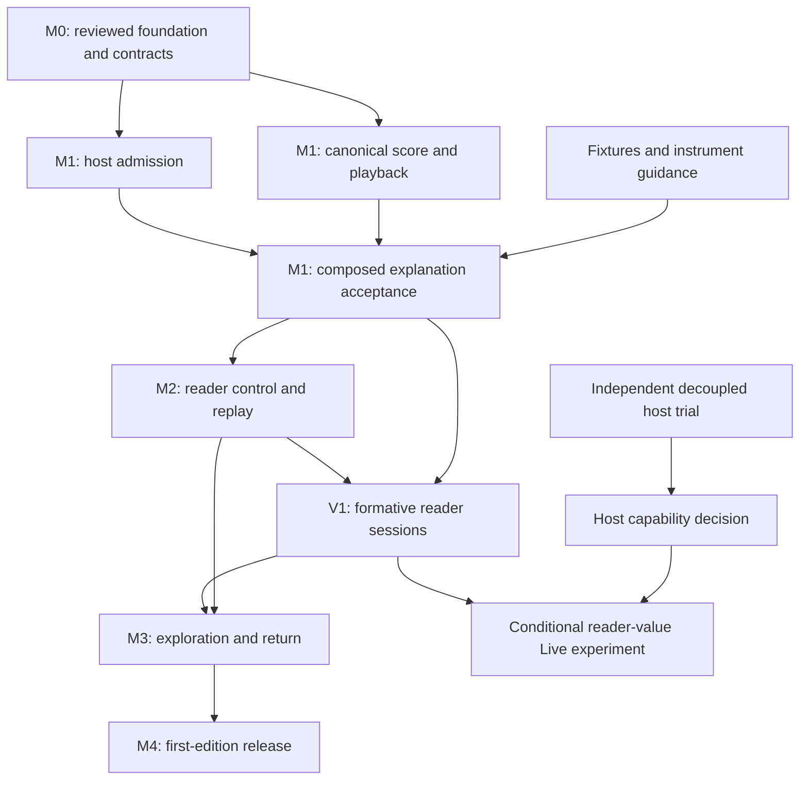

# RISE roadmap: a reader-controlled first edition

Date: 2026-10-03

Status: product direction approved; delivery roadmap. Milestones below are proposed work, not completed features.

## Product promise and scope

**Turn an answer into a coherent audiovisual experience you can explore and return to.**

The first edition serves one job: a short guided explanation. The model composes an admitted score before playback. RISE performs it with immediate reader controls. A reader can pause, ask a follow-up, explore an admitted response, and return without losing their place. The first supported provider host is ChatGPT; the same score and playback path must remain usable locally.

This roadmap changes the release sequence of the October Live roadmap. Composition is a product mode with its own character, not a temporary imitation of Live. Model-driven mutation during an utterance remains a separate research track. A failed ChatGPT Live trial does not block the Composer edition.

This is a milestone and ownership roadmap. Each engineering work package needs a narrow implementation plan against its actual starting commit before coding. It does not authorize deployment, public exposure or rewriting shared branches.

### Requirements and what earns its place

| Requirement | Who needs it and why |
|---|---|
| Coherent composition | Readers need a meaningful relationship between explanation, pacing and presentation. |
| Immediate local control | Readers need to pause, stop and adjust the experience without waiting for a model. |
| Clear follow-up boundaries | Readers need to know whether they are in the original explanation or an exploration, and how to return. |
| One durable score | Contributors need reproducible composition, validation and replay across hosts. |
| Reliable host admission | Readers must not begin an experience the server refused. |
| Small, governed instrument set | Models need choices they can use correctly; readers need comprehensible, accessible output. |
| Realtime research | Product development needs evidence about benefits that composition at boundaries cannot deliver. |

Remove full realtime mutation from first-edition release prerequisites. Defer broad renderer expansion, a new event protocol, scenes, generated renderer execution, public SDK commitments and additional hosts. Preserve existing admission, reader-owned AI and applicable release requirements. Existing canonical-source publication gates in [the earlier release ledger](RELEASE-ROADMAP-2026-08-20.md) remain in force for those reading experiences; this explanation edition does not certify them.

## Starting position

The latest assessment recorded main at `38332c468be98e8dffd671304e3076db06cdc758`, repair [PR #371](https://github.com/SyberLabs/RISE/pull/371) at `8819564483491f584c1d312b8fba10132ac8e61f`, and experiment [PR #372](https://github.com/SyberLabs/RISE/pull/372) at `65c1824fbeda95289c652368816be47d2cf590c4`. These are assessment references, not a claim that remote heads remain unchanged.

- Main and the repair candidate have diverged. Their integration needs an integrity review and fresh verification.
- The candidate repairs admission/Begin ordering, theme regressions and bounded visual handling. Its test results certify that candidate, not a future integrated release.
- An earlier ChatGPT Composer demonstration produced narration the reader confirmed hearing. Exact-release acceptance remains required.
- The original Gate 0 trial delivered mutations into separate widgets. Persistent-view and reciprocal Live behavior were not established. The decoupled probe has local evidence but awaits its real-host trial.
- The canonical score/compiler/Player path exists. Some Live presentation changes and reader controls still lack durable score representation.
- Catalog foundations exist. The first edition needs a curated useful subset, not a larger inventory.
- The [evaluation instrument](plans/LIVE-EVALUATION.md) exists; its study has not run.

## Architecture and working agreements

Use the existing Experience Program as the durable score, Current as an adapter, Session as the compiled presentation, Player as the playback clock, and Chamber as the stage. Do not create another runtime or persistence store.

Retain authored meaning and reader-authorized presentation changes where the score vocabulary represents them. Keep speech marks, transport receipts and observations as evidence. Replay means reproducing admitted content and presentation intent; it does not promise identical browser voices or sample-exact audio.

For the first edition, accept follow-up changes at explicit paused boundaries. Preserve experienced content. Resume or enter an admitted branch through existing machinery. A narrow future-content replacement is allowed only if an implementation plan proves it is necessary; a general event reducer and active-cue mutation system are not prerequisites.

Before independent coding begins, record the shared contract in one short design document: score fixture and validation boundary; successful/refused host result; reader-control authority; pause/resume position; follow-up admission and return behavior. Reuse existing interfaces wherever possible. Any required interface change has one owner and must be reviewed before consumers depend on it.

## Milestones and dependencies

### M0 — establish a trustworthy foundation

Owner: coordinator. Dependency: none.

- [ ] Refresh main and both draft heads; inventory repairs versus changes already landed.
- [ ] Reconcile the repair foundation with current main without losing themes, reader controls or admission checks.
- [ ] Regenerate the architecture diagram and run required CI and the production browser gate against the integrated commit.
- [ ] Review rebase integrity, unresolved findings and remaining test limitations; record the exact foundation commit.
- [ ] Freeze the minimal Composer contract described above.

**Exit:** a reviewed foundation and shared contract that downstream branches can consume. Current candidate verification alone does not close this milestone.

**Parallel now:** prepare explanation fixtures, interview protocol and instrument guidance; run the isolated host research trial. Production integration remains with the coordinator.

### M1 — deliver one complete composed explanation

Owners: score/playback agent, host/admission agent, experience-design agent. Dependencies: M0 for integration; content and test preparation can start sooner.

- [ ] Prove parity for the first-edition path from Current to Experience Program to compiled playback, preserving text, source anchors, themes and supported visual intent.
- [ ] Make model proposals, server admission and reader Begin distinct states. Refusals, malformed results and late results must leave accepted state safe.
- [ ] Demonstrate one explanation locally and in ChatGPT, using the same admitted semantics.
- [ ] Curate at most three existing instruments supported by the chosen playback surface. Document purpose, parameters, limits, accessibility and whether each is explanatory or atmospheric. Do not expose Neural as a Current/control instrument without separate admission work.
- [ ] Provide three short explanation fixtures with different presentation demands. The black-hole fixture remains one example rather than the sole test of the medium.

**Exit:** an end-to-end experience whose purpose is apparent on the first use, with exact-head audible and visual host acceptance recorded. Text remains usable when speech is unavailable, with an explicit visible state.

**Parallel:** core parity and Worker admission can be implemented separately after the contract is fixed. Instrument writing and fixtures can proceed alongside them. Changes to shared manifests/compilers stay with the score owner.

### M2 — make the experience reader-controlled

Owners: reader-experience agent and score/playback owner. Dependencies: M1 playable slice and M0 control/position contract.

- [ ] Make Begin, pause, resume and Stop predictable; Stop cancels pending speech and future playback work.
- [ ] Retain existing useful local pace and bounded visual controls. Document which are session preferences and which change durable presentation intent.
- [ ] Preserve place through pause/resume and reader navigation. Late callbacks must not restart stopped or replaced playback.
- [ ] Ensure controls are reachable on phone widths, usable by keyboard and compatible with reduced motion.
- [ ] Save/export the admitted explanation through existing interchange/Vault machinery and verify replay semantics.

**Exit:** the reader can complete, interrupt, resume and revisit an explanation without losing orientation. Reader changes survive replay when promised; transient preferences are identified accurately.

**Parallel:** UI accessibility work can use a fixed score fixture while core persistence is implemented. Shared runtime or Player edits must be serialized under their owner.

### V1 — test the product before expanding it

Owner: coordinator with human participants. Dependencies: M1 for initial observations; M2 for the full control experience.

- [ ] Conduct an initial round of five exploratory sessions using the short explanations. This is formative research, not a powered efficacy study.
- [ ] Observe whether readers understand the purpose, finish a passage, explain the role of the visuals, interrupt and return, and choose another experience.
- [ ] Record confusion, startup friction, atmosphere/preferences and comprehension separately. Do not convert novelty or preference into a learning claim.
- [ ] Make a written continue/change/stop decision: fix blocking usability problems, narrow the experience if necessary, and expand only where observed behavior supports it.

**Exit:** a specific reader benefit and a usable flow, supported by observations. If there is no clear benefit, revise composition and interaction before adding transport or renderer complexity.

**Parallel:** prepare M3 fixtures and its admission tests. Do not build broad follow-up machinery while the basic flow is unsettled.

### M3 — add bounded exploration and return

Owners: host/admission agent and reader-experience agent, coordinated by the score owner. Dependencies: M2 and V1 decision; follow-up contract frozen before coding.

- [ ] Pause at an explicit boundary for a reader question; retain the original score and return position.
- [ ] Admit the model's follow-up as a separate bounded experience or existing Dive branch. Reuse whichever existing mechanism satisfies the contract with less complexity.
- [ ] Clearly show exploration, loading, refusal and return states. Never play unadmitted follow-up content.
- [ ] Return to the original explanation without rewriting experienced content. Test cancellation, repeated requests and stale responses after Stop or navigation.
- [ ] Verify the same behavior in the local harness and real ChatGPT. If the host cannot support the desired initiation path, disclose the supported conversation flow rather than simulate it.

**Exit:** one coherent explanation → question → exploration → return journey. Continuous model mutation is unnecessary for this acceptance.

### M4 — release the first edition

Owner: coordinator. Dependencies: M0–M3, V1, and applicable security/distribution gates.

- [ ] Complete review and required CI on the exact release commit; record browser, speech, admission, cancellation and replay evidence.
- [ ] Witness the supported desktop and phone experience on real devices; distinguish emulation from device acceptance.
- [ ] Check reader-owned AI boundaries, production CSP/resources, accessible failure states and absence of inference credentials in widget/client output.
- [ ] Write onboarding and limitations around Composer and explicit follow-up boundaries.
- [ ] Prepare deployment/rollback and temporary-exposure shutdown steps; publish only through the authorized release process.

**Exit:** a small reliable edition with a clear promise, known supported environments and an exact-release evidence record. Unproven Live claims must not appear in release copy.

## Parallel research: does Live improve the product?

Owner: coordinator during real ChatGPT trials. Independent of the Composer critical path; integration into production is conditional.

1. Run the reviewed decoupled probe in a signed-in developer host, under the existing exact-head exposure/cleanup approval process.
2. Record persistent widget identity, mutation delivery, speech/tool ordering and reader feedback separately. Reader observation is required for audible claims.
3. Budget at most two planned host sessions for this probe. If inconclusive, produce a host capability report and stop expanding ChatGPT-specific plumbing until a concrete new hypothesis exists. This limit is a work budget, not a technical conclusion.
4. If the host passes, design one adaptation that serves the chosen reader job. Compare it with the composed experience before implementing a general mutation framework.
5. If the host fails, ship the supported Composer mode. A later RISE-owned transport experiment may test Live elsewhere; a ChatGPT result cannot establish a universal limitation.

Promote Live to a delivery milestone only when a concrete interaction works, readers benefit from it, and its latency, continuity, accessibility and operational cost are acceptable. The later controlled study can build on the existing evaluation instrument; changing its conditions requires revisiting study design rather than relabeling its results.

## Dependency map

The trial has no dependency edge into first-edition release. M1 is integration of parallel work, not three independent claims of product completion.

## Agent ownership and dispatch order

With four concurrent slots, use a coordinator and at most three active agents. Start coding agents only after the foundation/contract they consume is available. Use LUNA at medium or high effort for implementation, as requested; give each a separate worktree, a `codex/` branch and one narrow PR.

| Lane | Owns | Starts | Must not change |
|---|---|---|---|
| Coordinator | M0, real host trial, integration, release and evidence | Immediately | No unreviewed shared branch rewrite |
| Score/playback agent | Canonical parity, manifests, durable intent, replay; narrowly required compiler/Player work | After M0; read-only assessment earlier | Worker, provider transport, deployment |
| Host/admission agent | `worker/*` and its tests; admitted/refused follow-up boundary | After M0 contract | Core compiler/Player and reader UI |
| Experience agent | Fixtures/instrument guidance first; reader UI and boundary navigation after contracts | Preparation immediately | Worker, manifests, shared runtime/Player without coordination |

The coordinator retains widget/MCP bridge integration, `.github/workflows/*`, Wrangler configuration, lockfile and production verification. The experience agent can own UI components but cannot concurrently edit shared playback or bridge files. When one agent finishes, reuse its slot for read-only review or a narrowly scoped next task; do not create a second infrastructure lane.

Contract changes pause affected consumers until agreed. Independent investigations can continue. Integrate one reviewed PR at a time through required CI, then verify the assembled behavior rather than treating isolated green tests as integration evidence.

## Effect on earlier assignments and the larger roadmap

This roadmap supersedes the release sequence and long-horizon scope in [the earlier parallel assignment](superpowers/handoffs/2026-10-03-parallel-roadmap-assignment.md). Retain its semantic-convergence work and source-coordinate discipline. Defer its general temporal reducer and three-stage mutation demonstration; they are conditional Live work rather than first-edition prerequisites. Preserve earlier handoffs and trial records as historical evidence.

After the first edition earns use, prioritize by the observed limitation:

- Composition limitations → better authoring vocabulary and instruments.
- Exploration friction → stronger boundary-based continuation and branching.
- Proven need for continuous adaptation → canonical events and temporal authority, then a reciprocal Live demonstration.
- Voice quality/timing limitations → a measured voice-clock improvement.
- Repeated external integration demand → scenes, SDK stabilization and additional hosts.

These are evidence-triggered options, not an automatic platform backlog.

## Immediate execution order

1. Coordinator refreshes and reconciles the repair foundation; writes the shared Composer contract.
2. Prepare three explanation fixtures and the reader-session protocol in parallel.
3. Run the isolated decoupled ChatGPT trial while foundation work proceeds, with its own evidence and shutdown record.
4. Dispatch score/playback and host/admission implementation from the reviewed foundation; the experience lane prepares and then consumes their contract.
5. Integrate M1, observe readers, complete M2 and adjust from the findings.
6. Build the narrow M3 exploration journey, verify the exact release, and deliver M4.

Planning checks: every included capability serves the reader job or reproducible delivery; speculative realtime/platform layers were removed from the release path; one semantic center and clear file ownership remain. This document has been checked for dependency consistency. Product quality, host behavior and release readiness still require the execution and witnessed evidence above.
