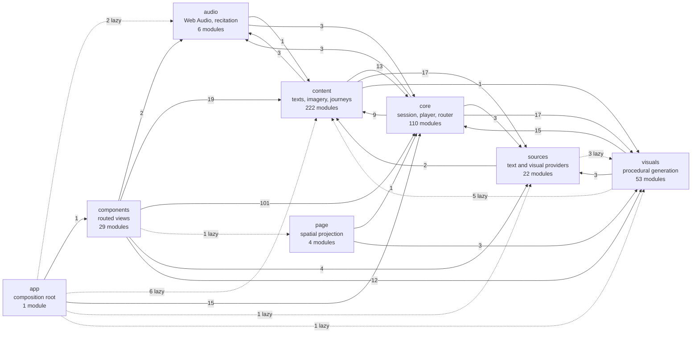

# RISE — system design

> The canonical, living description of how RISE is built and why it is built
> that way. There is one of these. If something here disagrees with the tree,
> **the tree is right and this file is a bug** — `src/core/system-design.test.js`
> exists to make that bug fail a build rather than mislead a reader.

**Scope.** Three things, in order: what the system *is* (§1–§6), the contracts
that constrain it (§7), and **every significant design decision with the
alternatives rejected and the tradeoff that decided it** (§8). §9 records what
this design costs, and §10 says how the document is kept true.

**When to update this file.** In the same change that alters a boundary, adds
or removes a room, changes a contract, or settles a decision in §8. Not after.

---

## 1. What RISE is

A browser-based audiovisual reader. Text is broken into **atoms** — a word, a
phrase, a line — each carrying a duration. A **Player** advances atoms against a
clock. A **Chamber** paints them over procedural or sourced imagery with a bed
of sound. The same compiled session can instead be projected into **Page**, a
spatial typographic composition. An **Experience Program** can author what
appears when.

Around that engine sit rooms: Portal, Library, Chapel and Rosarium, Workshop,
Vault, Scriptorium, Curia, Journeys, Via, Keystones, Settings.

It ships as static files to a CDN. There is no backend.

---

## 2. The four constraints that decide everything else

Every decision in §8 is downstream of these. They are the axioms; everything
else is a recommendation.

1. **Nothing leaves.** A reader's text, reading history and personal media stay
   in their browser. This is enforced by there being nowhere to send them, not
   by a policy promise.
2. **Reverent degradation.** A work, image or sound that will not resolve is
   *absent* — never a broken frame, never a substitute. Silence outranks
   approximation.
3. **Provenance travels with the work.** A reader should always be able to tell
   a received text from one written here, and every visual carries its rights.
4. **Structure is read, never inferred.** An ingest may not destroy a
   distinction the source made, and may not re-guess one it discarded.

---

## 3. The diagram

```text
╔═══════════════════════════════════════════════════════════════════════════════╗
║                            RISE — SYSTEM DESIGN                               ║
╚═══════════════════════════════════════════════════════════════════════════════╝

  BUILD PLANE — run deliberately, by a person, never on a reader's request
  ┌─────────────────────────────────────────────────────────────────────────┐
  │  scripts/  (ingest · harvest · audit · catalog · voice · render · gate)  │
  │                                                                         │
  │   Standard Ebooks ─┐                                                    │
  │   Gutenberg ───────┼─▶ *-ingest.mjs ─▶ words-in == words-out ─▶ sha256  │
  │   Douay-Rheims ────┘         │              (refuses on mismatch)       │
  │                              ▼                                          │
  │   Met · AIC · NASA ─▶ *-harvest.mjs ─▶ contact sheet ─▶ HUMAN PIN        │
  │                                                                         │
  │   Kokoro TTS ───────▶ build-voice-pack.mjs ─▶ recitation WAV + manifest  │
  │                                                                         │
  │   check-release-readiness.mjs  ── fails closed while any gate is open    │
  └────────────────────────────────┬────────────────────────────────────────┘
                                   │  emits JS modules + public/ assets
                                   ▼
  BUILD                     ┌──────────────────┐
                            │   vite build     │  Rollup follows dynamic
                            │   ~3 s           │  imports; no manualChunks
                            └────────┬─────────┘
                                     ▼
  DELIVERY   ┌──────────────────────────────────────────────────────────┐
             │  CDN (Netlify) · SPA rewrite · /assets/* immutable        │
             │  index.html no-cache — it names the hashed chunks         │
             │  CSP: self + named museum/text origins; no third-party JS │
             └────────────────────────┬─────────────────────────────────┘
                                      ▼
╔═══════════════════════════════════════════════════════════════════════════════╗
║  BROWSER — the entire runtime. No server, no account, no request path.        ║
║                                                                               ║
║   index.html ─▶ src/app.js  — composition root: boots, owns global services,  ║
║                               registers routes, translates component events   ║
║        ┌──────────────┬───────────────┬──────────────┬─────────────────┐      ║
║        ▼              ▼               ▼              ▼                 ▼      ║
║  ┌──────────┐  ┌────────────┐  ┌───────────┐  ┌────────────┐  ┌─────────────┐║
║  │  Router  │  │  Session   │  │  Player   │  │   Audio    │  │   Visual    │║
║  │ in-memory│  │  Compiler  │  │ the clock │  │  Engine    │  │   Cortex    │║
║  │ backstack│  │ THE ONLY   │  │ 5 states  │  │ Web Audio  │  │ the ONLY    │║
║  │ crossfade│  │ WAY IN     │  │           │  │ recitation │  │ flash       │║
║  └────┬─────┘  └─────┬──────┘  └─────┬─────┘  └─────┬──────┘  │ dispatcher  │║
║       │              │               │              │         └──────┬──────┘║
║       │              │               │              │                │       ║
║       ▼              │               ▼              ▼                ▼       ║
║  ┌─────────────┐     │        ┌────────────────────────────────────────────┐ ║
║  │   ROOMS     │     │        │  SURFACES                                  │ ║
║  │  Portal     │     └───────▶│  Chamber (stream, in time)                 │ ║
║  │  Library    │              │  Page    (spatial, same Session)           │ ║
║  │  Chapel/Via │              └────────────────────────────────────────────┘ ║
║  │  Rosarium   │                                                             ║
║  │  Workshop   │   each room is lazily imported with its own stylesheet      ║
║  │  Vault      │                                                             ║
║  │  Scriptorium│   ┌──────────────────────────────────────────────────────┐  ║
║  │  Curia      │   │  SOURCES  registry + providers + IndexedDB cache      │  ║
║  │  Journeys   │   │  archive · local · gutenberg · sacred · arxiv ·       │  ║
║  │  Keystones  │   │  generated · wikimedia   (failure degrades one, not   │  ║
║  │  Settings   │   │  the app)                                             │  ║
║  └─────────────┘   └──────────────────────────────────────────────────────┘  ║
║                                                                               ║
║   STORAGE  localStorage (settings, journals, blueprints, images, orbital) ·   ║
║   IndexedDB (workshop media, personal swells, local works, source cache) ·    ║
║   flash consent is a ONE-USE IN-MEMORY capability, deliberately not           ║
║   persisted (§8.18).  src/core/user-data.js is the export and erase           ║
║   inventory — a store missing from it cannot be carried out or cleared.       ║
╚═══════════════════════════════════════════════════════════════════════════════╝
        │  anonymous · no-referrer · abort + timeout        ▲
        ▼                                                   │ failure ⇒ stillness
  ┌────────────────────────────────────────────────────────────────────────┐
  │  THIRD PARTIES  Met · Art Institute · Cleveland · Rijksmuseum ·         │
  │  Wikimedia · Gutenberg · arXiv.  Pinned catalogs are preferred to live  │
  │  search; a live call is a convenience, never a dependency.              │
  └────────────────────────────────────────────────────────────────────────┘

  OFFLINE RENDER — a separate path, deliberately not the live one
  ┌────────────────────────────────────────────────────────────────────────┐
  │  Experience Program ─▶ compileRenderPlan ─▶ src/core/render/clock.js    │
  │  (rational frame index, NOT rAF) ─▶ Playwright Chromium paints the      │
  │  Chamber stage at explicit presentation times ─▶ ffmpeg H.264/AAC       │
  └────────────────────────────────────────────────────────────────────────┘
```

### The import graph, read from the tree

The diagram above is drawn: it says what the design is, and §10 checks the
claims in it that can be checked. This one is derived — `npm run docs:diagram`
reads every non-test module under `src/`, resolves its relative imports, and
writes what follows. It cannot disagree with the code, because the code writes
it, and CI fails when the committed copy is not what `src/` produces.

<!-- BEGIN GENERATED DIAGRAM: npm run docs:diagram -->



Solid is a static import and travels in the first load; dashed is reached
only through `import()` and is deferred. The number on an edge is how many
imports it stands for. Generated by `npm run docs:diagram` — edit the
generator, not the diagram.

<!-- END GENERATED DIAGRAM -->

Layering is described here, not enforced: an edge is a fact, not a permission.
A dashed edge is the shape §8.24 argues for — deferred rather than deleted —
and it is the same set the first-load measurement prices.

---

## 4. The three planes

| Plane | Holds | Changes when | Shipped to a reader |
|---|---|---|---|
| **Control** | `src/` code — engine, rooms, surfaces, providers | a behaviour changes | yes, as hashed chunks |
| **Data** | works, chapel books, catalogs, recitation audio, pinned imagery | an editorial act occurs | yes; currently **through** the control plane (see §8.2) |
| **Build** | `scripts/` — ingest, harvest, audit, render, release gate | a process changes | no |

The build plane is the one that enforces the §2 constraints. Its refusals —
word-count mismatch, missing rights basis, an uncertified work on a public
shelf — are the reason those constraints are properties rather than intentions.

---

## 5. Boundaries

**`src/app.js`** is the composition root. It owns global services and
translates component events into navigation or session compilation. It is the
only module allowed to know every room.

**`src/core/router.js`** owns crossfade transitions, view activation and
deactivation, the back stack, and failure restoration. Routed components must
make document-level listeners lifecycle-aware with `activate()`,
`deactivate()`, `destroy()`. A rejected async initializer must not leave the
transition lock held or the previous view hidden.

**`src/core/session-compiler.js`** is the only way a reading is built. Every
launch surface calls it. Do not recreate chunk or pacing logic in a component.

**`src/core/player.js`** owns the authoritative reading clock and the playback
state machine: `idle`, `playing`, `paused`, `interlocuting`, `complete`.
`src/components/Chamber.js` renders and does not own the clock.

**`src/visuals/visual-cortex.js`** is the only flash dispatcher. It owns active
visual selection, decoded image pools, abort ownership on config change, the
execution-time consent and photosensitivity checks, and the presence lifecycle.

**`src/sources/registry.js`** owns provider discovery and initialization.
Provider initialization is retryable; registry initialization is idempotent; a
provider failure degrades that provider, not startup.

**Layering, checked by §10:** `src/core` and `src/visuals` never import from
`src/components`, statically or dynamically. Rooms communicate with the
application through callbacks passed in at construction.

### The rooms

Every place a reader can be. This list is checked against `src/components/`
in both directions by §10, so a room added without a line here, or a line here
outliving its room, fails a build.

| Room | Module | What it is |
|---|---|---|
| Portal | `src/components/Portal.js` | the hub, and the first screen |
| Keystones | `src/components/Keystones.js` | the public entry corridor |
| Chamber | `src/components/Chamber.js` | a reading, in time |
| ChamberOrbital | `src/components/ChamberOrbital.js` | tuning a reading before it starts |
| Library | `src/components/Library.js` | the prepared editions |
| Chapel | `src/components/Chapel.js` | the scripture corpus |
| Rosarium | `src/components/Rosarium.js` | the Rosary, on the liturgy engine |
| Via | `src/components/Via.js` | the Stations of the Cross |
| Workshop | `src/components/Workshop.js` | authoring a composition |
| Vault | `src/components/Vault.js` | saved compositions and archetypes |
| Scriptorium | `src/components/Scriptorium.js` | a model composes; a gate refuses |
| Curia | `src/components/Curia.js` | the source and rights record |
| Journeys | `src/components/Journeys.js` | authored long-form experiences |
| Settings | `src/components/Settings.js` | preferences, export and erase |
| Guide | `src/components/Guide.js` | onboarding, as an overlay rather than a route |
| BetaGate | `src/components/BetaGate.js` | invitation UX; **not** a security boundary (§7) |

Four modules in `src/components/` are deliberately not rooms, because they only
ever appear inside one: `src/components/Admit.js`,
`src/components/NamingModal.js`, `src/components/SourceBrowser.js` and
`src/components/VisualNavigator.js`.

---

## 6. One reading, end to end

```text
  a work is chosen
        ▼
  provider.get(id) ──▶ payload  (a dynamic import today — see §8.2)
        ▼
  session-compiler.js
        │  validate and bound input        50–1000 wpm · 2,000,000 chars/source
        │  chunk each source               MAX_CHUNK_WORDS 16 · PHRASE_FLOOR 5
        │                                  verse is READ from the edition
        │  attach source name and id to every atom
        │  insert timing-locked source boundaries
        │  apply the pacing curve           timingLocked atoms are exempt
        ▼
  Session { atoms[], totalDuration }   ── the source of truth for duration
        ▼
  player.js  ── advances atoms; a visual presence PAUSES the reading clock
        │        and is awaited; a rejected visual resumes without entering
        │        visible-duration accounting
        ▼
  Chamber (stream)  │  PageReader (spatial)   — same Session, two projections
```

---

## 7. Contracts that must hold

- **Visual safety is an execution-time veto**, including when photosensitivity
  mode is enabled during a running session. Never auto-grant consent from a
  preset or a saved configuration.
- `VisualFlashGate` admits a presentation only within a visible-duty ceiling
  over a rolling window, and only after the previous presence has rested. A
  gate reservation is committed **only after the source renders**, so
  unavailable content consumes no cadence budget.
- **Treat as untrusted at every HTML or URL sink:** remote metadata, uploaded
  filenames, pasted text, saved browser data. Prefer `textContent`; use
  `escapeHtml` and `safeUrl` only where templating is unavoidable.
- **Network and worker failure must produce bounded stillness or a local
  fallback**, never an unbounded playback stall.
- **A new personal store is added to `src/core/user-data.js` in the same change
  that introduces it.** A store missing from that inventory is data export
  cannot carry out and erase cannot clear.
- **The BetaGate is invitation UX, not an authorization boundary.** Invite data
  and codes ship to the browser. Real access control would require a
  server-side identity service, which §8.1 rejects.

---

## 8. Decisions, and the alternatives rejected

The format is fixed and checked by `src/core/system-design.test.js`: every
entry states **Chosen**, **Rejected**, **Why**, and **Status**. `Status` is one
of `settled`, `open`, `deferred`, or `reversed`.

### 8.1 No backend

- **Chosen:** the browser is the entire runtime. Static files on a CDN.
- **Rejected:** a server tier with accounts, sync, and server-side identity.
- **Why:** the tradeoff is unusually lopsided. A backend buys cross-device sync,
  real access control, server-side rate limiting toward museum APIs, and
  telemetry. It costs the §2.1 constraint outright — "nothing leaves" stops
  being a property of the architecture and becomes a promise about conduct —
  and it imports availability, consistency, replication, authentication,
  authorization and an operational budget into a project that currently has
  none of those problems. A CDN already scales to any readership without a
  design change. **The one thing genuinely lost is real access control**, and
  that loss is accepted and named in §7 rather than hidden.
- **Status:** settled.

### 8.2 Content is data, addressed by its own hash

- **Chosen:** a work is a content-addressed asset. `content/manifest.json`
  (schema `rise.content-manifest.v1`) names every work; the payload lives at
  `content/works/<sha256>.json` and is fetched at read time by
  `src/core/content-store.js`, which verifies the digest on arrival. **The hash
  is the URL**, so the address an object was fetched by is the digest it must
  have.
- **Rejected:** generated `.js` modules under `src/content/`, reached by dynamic
  `import()` from a catalog — which is what this was until it was cut.
- **Why:** compiling books bought one real thing — Rollup hashed, split and
  cache-busted payloads for free, and a missing import was a build error rather
  than a 404. It cost far more. The JavaScript compiler parsed novels; the
  repository carried the corpus; a test fork needed a raised heap ceiling to
  compile a single book; and a withheld work had to be unlinked from the
  catalog or the bundler shipped it anyway — the defect that once built and
  deployed 82 MB of unreachable books. Measured at the cut: shipped JavaScript
  fell from 18.7 MB to 3.25 MB with **no book text left in it at all**, and
  first load fell to 58.8 KB brotli over three requests.
  **What the old design could not buy at any price** is what this one gets for
  nothing: a payload is re-verified in the reader's browser on every read, so a
  silently corrupted object is unreadable rather than readable-and-wrong. A
  work that will not verify is *absent*, per §2.2 — never substituted.
- **Status:** settled. Recorded as `open` when this register was written, and
  closed by the change that cut the seam.

### 8.2a Withholding is a manifest field, not a code path

- **Chosen:** a withheld work appears in `content/manifest.json` with
  `shelved: false` and its `withheldReason`, and its payload is simply not
  addressed.
- **Rejected:** the earlier mechanism, where a withheld work carried metadata
  but no `load` function, and a test asserted that correspondence in both
  directions.
- **Why:** that test — `reachable-payloads.test.js` — existed to stop the
  bundler shipping something a runtime filter could not remove. Once content is
  not built, the bundler is not on the path, and the defect it guarded is not
  merely fixed but **impossible**. Deleting a test because its subject ceased
  to exist is the strongest available form of a fix, and is why the deletion
  appears in the same change as the seam. `content-manifest.test.js` replaces
  it, asserting what is now true: every shelved work resolves, and every
  withheld one states a reason.
- **Status:** settled.

### 8.3 A withheld work is unlinked, not deleted

- **Chosen:** a withheld work keeps its metadata, provenance and a stated
  reason. The payload stays on disk and in git.
- **Rejected:** deleting the payload.
- **Why:** a withholding is an editorial act, and it must stay reversible and
  legible to a future curator — "withheld, never deleted," with every
  withholding stating a reason, enforced by test. The *mechanism* for keeping a
  withheld work off the wire has changed twice and is recorded in §8.2a; the
  rule about not destroying the payload has not changed at all.
- **Status:** settled.

### 8.4 No `manualChunks`

- **Chosen:** Rollup's default splitting, which follows the dynamic imports we
  write.
- **Rejected:** named cache groups for large subsystems.
- **Why:** it was a grouping directive read as a deferral one. Naming a module
  there makes it a dependency of the **entry**, so the shell emits a
  `modulepreload` and the browser fetches it before the reader has chosen
  anything — the audio engine kept being preloaded after `app.js` was changed
  to import it dynamically, because the list still named it. It also suppressed
  Rollup's own "dynamic import will not move module into another chunk"
  warnings, which are the report that a deferral has been defeated. Measured
  worth of the whole mechanism: three kilobytes.
- **Status:** settled.

### 8.5 Recitation is a pre-built voice pack, not runtime TTS

- **Chosen:** Kokoro runs at build time; the deployed app plays same-origin
  audio addressed by normalized phrase text.
- **Rejected:** running the model in the reader's browser — and this one was
  *measured* before it was rejected, not assumed. The browser path was built
  and tried: `speechSynthesis` is a formant synthesiser and was never a
  candidate; q8 WebAssembly ran at a real-time factor of 2.6–3.0 against a
  budget of 0.75; q4f16 produced non-finite samples; the WebGPU path produced
  numeric explosions large enough that the code now rejects WebGPU before
  encoding. The record is kept in `docs/vision/RECITATION-SPEC.md` rather than
  deleted with the code.
- **Why:** beyond the measurements, runtime inference would need a model host,
  a WebAssembly policy exception and a large first-run download, and would make
  a reading depend on a third party. Pre-building keeps the CSP free of any
  script or WASM exception and makes recitation byte-identical and certifiable
  — the acoustic ledger binds a human verdict to exact audio bytes, which
  runtime synthesis could not support. The governing rule was written as
  "treat speech as unavailable rather than choosing a backend by feature
  detection alone," which is §2.2 applied to sound. **The cost is size**: the
  packs ship uncompressed, and that is the second-largest known cost (§9).
- **Status:** settled for the mechanism; the delivery format is **open**.

### 8.6 MP4 render is an offline Node path, not in-browser capture

- **Chosen:** a plan is compiled, Playwright Chromium paints the Chamber stage
  at explicit presentation times, ffmpeg encodes.
- **Rejected:** `MediaRecorder` or WebCodecs capturing a live session.
- **Why:** capture records whatever the machine managed to draw, so the artifact
  depends on the recording machine's load. The offline path advances a
  deterministic rational frame clock (`src/core/render/clock.js`, explicitly
  *not* `requestAnimationFrame` and *not* `AudioContext.currentTime`), so the
  same program yields the same frames. The cost is that render is not available
  to a reader in the browser: the production build carries no write path, and
  the Workshop hands out a job description for the CLI instead.
- **Status:** settled.

### 8.7 The live path has many frame loops; the render path has one clock

- **Chosen, for now:** `Player` owns the reading clock; each persistent visual
  field runs its own `requestAnimationFrame` loop.
- **Rejected so far:** one scheduler with subscribers and a single
  `sessionTime`.
- **Why:** each engine was written to own its own animation, and nothing forced
  a shared timeline. The cost is that nothing can answer "what time is it" for
  a session as a whole, and a rendered MP4 and a live reading of the same
  session run on different notions of time. The deterministic clock the live
  path lacks **already exists** in the render path.
- **Status:** open.

### 8.8 Pinned catalogs are preferred to live museum search

- **Chosen:** imagery is harvested offline, reviewed on a contact sheet, and
  pinned. Live API calls are a convenience.
- **Rejected:** live search against museum APIs as the primary path.
- **Why:** live search cannot be rate-limited across readers, cannot be
  rights-checked before display, and puts a third party on the reading path.
  Harvest-and-pin means a human approved every image and its rights before a
  reader could meet it, which §2.3 requires. Two rejections are recorded with
  their evidence: the Wikimedia category registry is **empty by design** after
  an audit found a category silently returning nothing for its whole life —
  "a searched source can rot invisibly, and a pinned one cannot" — and the Met
  provider was retired because its public API serves roughly 750-pixel
  derivatives over pools too shallow to hold a reading. The cost is a smaller,
  slower-moving collection.
- **Status:** settled.
- **Loose end:** `netlify.toml` still grants `connect-src` to `corsproxy.io`,
  and **no module under `src/`, `scripts/` or `e2e/` calls it.** It is a stale
  allowance rather than a live dependency — a CSP grant nothing needs is a
  surface with no purpose, and it should be removed.

### 8.9 Fifteen certified editions, not eighty-eight acquired ones

- **Chosen:** a small shelf chosen as acceptance fixtures for textual *forms* —
  epic, drama, lyric, wisdom, essay, novel — each ingested structure-preserving
  and certified end to end.
- **Rejected:** the accumulate-then-clean loop that produced eighty-eight
  Gutenberg works.
- **Why:** the old loop was acquire → ingest → find garbage → write a detector →
  clean → find different garbage. It could not terminate, because a detector
  registry finds only what a signature already describes: "every detector
  reports zero" gets *weaker* as you learn more. A canon of favourites proves
  nothing; a canon of forms proves the instrument. The cost is a catalogue small
  enough to look unfinished, accepted deliberately.
- **Status:** settled.

### 8.10 Vanilla DOM, no UI framework

- **Chosen:** direct DOM construction and template strings, one bespoke module
  per room, one production dependency in the whole project.
- **Rejected:** React, Vue, Svelte or any virtual-DOM library.
- **Why:** the tradeoff is real in both directions. A framework would give
  declarative rendering, diffing, and would largely remove the `innerHTML`
  surface that currently requires `escapeHtml` discipline at every sink. It
  would cost a dependency, a rewrite of every room, and a rendering model
  between the author and the paint — in a project whose whole subject is
  precise control of what appears when. The recorded defects in this codebase
  have been structural, not rendering bugs.
- **Status:** settled, and revisited if the `innerHTML` surface ever produces a
  real defect rather than a theoretical one.

### 8.11 JavaScript, not TypeScript

- **Chosen:** plain JavaScript with JSDoc where it helps.
- **Rejected:** a TypeScript migration.
- **Why:** types would catch a class of error this project has not been making.
  Its expensive defects have been a vocabulary living in two places, a guard
  that could not fail, structure destroyed at import, and a build-time
  dependency a runtime filter could not remove — none of which a type system
  sees. The cost of migrating is a six-figure line change across the tree.
- **Status:** settled for now; the reasoning is about observed defect classes,
  so new evidence should reopen it.

### 8.12 In-memory routing; almost nothing has a URL

- **Chosen:** a view registry with a back stack. Only the Keystone corridor and
  the rosary door have real addresses.
- **Rejected so far:** URL-addressable rooms.
- **Why:** no reason recorded in the tree — the router was built for
  transitions, and addresses were never required. The cost is that most of RISE
  cannot be linked to, browser Back does not meaningfully work inside a room,
  and a reload lands on the Portal. `handleNavigate` already pushes history for
  one corridor, so the mechanism exists.
- **Status:** open.

### 8.13 jsdom for the suite; real browsers for what jsdom cannot see

- **Chosen:** Vitest on jsdom for the unit suite, plus a Playwright browser
  suite, plus two unit tests that use real system tools — one hands bytes to a
  real ffmpeg, one paints a live Chamber stage in real Chromium.
- **Rejected:** a stub for either of those two.
- **Why:** "a stub would only prove we can satisfy our own stub." Those two
  tests are the reason CI can claim an MP4 can be produced and a frame can be
  painted at all. The cost is that the runner must install ffmpeg and Chromium,
  and that jsdom remains a weak substrate for Web Audio, IndexedDB, device
  pixel ratio and real animation frames.
- **Status:** settled; broadening the real-browser layer is open.

### 8.14 A fork's heap ceiling is named, not inherited

- **Chosen:** test forks start with an explicit `--max-old-space-size`.
- **Rejected:** scaling worker count against system memory.
- **Why:** it could not have worked — what kills a fork is its own V8 old-space
  limit, and no number of workers changes that limit. The suite passed on a
  workstation and died on CI over nothing either machine was short of, because
  Node 20 and Node 22 default that ceiling differently. Naming it removes the
  dependence on which Node picked the number.
- **What this entry predicted, and got wrong.** It said the cap was raised
  around a cause that was still there: V8 died in
  `CompilationCache::LookupScript → String::SlowFlatten`, flattening a module's
  source text to compile it, and the modules that size were the books — so the
  ceiling was expected to come down once §8.2 removed them from the module
  graph. §8.2 resolved, the books left, **and the ceiling is still needed.**
  Measured rather than assumed: a fork capped at 2048 still dies, and the stack
  is now an ordinary incremental-marking failure under the event loop.
  Removing the books removed one file's ability to fill a heap by itself; it
  did not change what a fork accumulates across the files it is handed.
- **Status:** settled. Do not delete this on the theory that §8.2 made it
  unnecessary — that theory was tested and is false. The test is one command:
  cap a green run at 2048 and see whether it is still green.

### 8.15 Release admission fails closed, and humans hold the last gate

- **Chosen:** `npm run release:check` is a single admission report that exits
  nonzero while any machine-verifiable *or declared human* gate is open.
  Certification is bound to bytes and withdrawn automatically by re-ingest.
- **Rejected:** treating a green build as sufficient.
- **Why:** "a green build is necessary, never sufficient." Editorial,
  acoustic, device and comprehension judgements cannot be automated, and a
  suite that passed would otherwise imply they had been made. The cost is that
  the public debut is blocked on human throughput, which is the real critical
  path today and is stated as such rather than engineered around.
- **Status:** settled. Do not weaken the checker to obtain green; close the
  named evidence gap.

### 8.16 A deploy must not strand an open tab

- **Chosen:** a `vite:preloadError` listener and a router check treat a failed
  chunk import as a stale build and reload **once**, guarded by a sentinel;
  `index.html` is served `must-revalidate`.
- **Rejected:** letting the tab break, and reloading unguarded.
- **Why:** `index.html` names the hashed chunks, so a tab left open across a
  release asks for a file the new deploy replaced, gets a 404, and can no longer
  reach any view it had not already loaded. A stale chunk is not a transient
  network error and retrying cannot fix it. The sentinel exists because an
  unguarded reload turns a real network failure into a loop.
- **Status:** settled.

### 8.17 The catalogue is derived at build time

- **Chosen:** `scripts/build-division-index.mjs` precomputes division structure;
  withheld divisions go to a separate file nothing shipping imports.
- **Rejected:** deriving divisions in every browser.
- **Why:** it lets a card say how many chapters a work has without downloading
  the work. Labels are verified against the divided text rather than against
  counts, because a count-only check passed while chapter labels drifted and
  broke Scriptorium navigation.
- **Status:** settled.

### 8.18 Visual consent is one-use and in memory

- **Chosen:** consent to flashing imagery is an in-memory capability for one
  presentation.
- **Rejected:** the former browser-session grant held in `sessionStorage`.
- **Why:** a persisted grant means a reader who consented once meets flashing
  imagery later without being asked, including in a room they did not consent
  in. `sessionStorage` is now only ever *cleared*, never written. Consent is
  also never auto-granted from a preset or a saved configuration (§7).
- **Status:** settled.

### 8.19 A deleted room keeps its data

- **Chosen:** when a room is deleted, its persisted keys and data namespaces
  stay. The Solarium is gone and `rise_sol_plan_v1` remains in
  `src/core/user-data.js`; the Atrium room is gone and its `atr-` accession ids
  and `atriumCollections` field remain.
- **Rejected:** deleting the keys with the room.
- **Why:** "a key dropped from that registry is data that export cannot carry
  out and erase cannot clear" — a reader who planned a day in the Solarium
  still has one saved. Renaming a persisted key is a migration, not a cleanup,
  **and doing it inside a deletion is how a deletion becomes an outage.** The
  key is removed when nobody can still be holding one, which is not the same
  day the room goes.
- **Status:** settled.

### 8.20 One source of truth for a limit

- **Chosen:** `src/core/reading-limits.js` holds the pace bounds, and every
  surface imports them.
- **Rejected:** each surface carrying its own slider range.
- **Why:** a reader who chose 60 wpm was silently overridden to 100, because a
  narrow window was the min and max of one modal's slider, copied twice. This
  is the defect class that recurs most in this codebase — a vocabulary living
  in two places where only one learns a new word — and the standing rule is to
  prefer deleting one copy to synchronising two. Where duplication is
  unavoidable, a test asserts the two agree, which turns silent drift into
  loud failure.
- **Status:** settled.

### 8.21 The public shelf serves candidates, and says so

- **Chosen:** `RELEASE_SERVES_UNCERTIFIED` is `true`, written in source rather
  than a build flag, and the shelf tells the reader a work is a candidate.
- **Rejected:** failing closed until certifications land.
- **Why:** failing closed was the right default and the wrong outcome — nothing
  has ever been certified, so the public shelf served **nothing** while
  development served everything. Putting the override in source rather than in
  an environment variable means it is visible in review and cannot be set
  accidentally by a deploy.
- **Status:** open, and explicitly temporary. Set it to `false` the day the
  certifications land.

### 8.22 Gallery is the default visual surface

- **Chosen:** a reader who has expressed no preference gets Gallery —
  continuous imagery behind the text.
- **Rejected:** rhythmic full-frame flashing as the default.
- **Why:** Gallery is the only surface that never flashes and never goes black,
  so it is what an unasked reader should meet, and it needs no consent prompt.
  Raising a photosensitivity warning over a surface that does not carry the
  risk asks a reader to accept a danger that is not there. A domain that
  authors its own surface — Chapel, a Vault program — still wins, per the
  three-layer law: content authors, the runtime follows, the cortex renders.
- **Status:** settled.

### 8.23 Production carries no write path

- **Chosen:** the Curia apply endpoint and the MP4 export endpoint are Vite
  plugins with `apply: 'serve'`, so they exist only on the dev server.
- **Rejected:** shipping write endpoints with the static build.
- **Why:** a static deploy with no write path cannot be made to write. The cost
  is that the Workshop's export hands a reader a job description for the CLI
  instead of a file, which §8.6 already accepts.
- **Status:** settled. Production also ships no source maps, to keep the bundle
  opaque.

### 8.24 Deferred rather than deleted

- **Chosen:** Journeys are on ice — the published list is empty while the
  scores, tests and compiler stay. RISE Chain stays out of production.
- **Rejected:** re-anchoring Journey scores quickly, and shipping Chain under
  release pressure.
- **Why:** Journey scores quote editions the canon no longer serves, so their
  anchors broke — correctly. **Re-authoring someone's score against a new
  translation is an editorial act, not a repair.** Chain was held back because
  production pressure would immediately impose questions of attribution,
  moderation, and whether generation could accidentally reproduce long source
  passages — questions better answered before readers than after.
- **Status:** deferred.

### 8.25 The licence boundary is drawn by bytes, not directories

- **Chosen:** code is Apache 2.0; authored strings, curated selections and
  names are reserved; visual engine *output* is not reserved separately from
  the engine.
- **Rejected:** splitting the licence by directory, and reserving procedural
  output as composition.
- **Why:** the directory split "got two answers, which is the same as getting
  none," because a directory holds both code and authored text. Reserving
  engine output was dropped on the reasoning that **a grant to run and modify
  the engine is a grant to the images it draws** — claiming otherwise while
  licensing the engine Apache would be incoherent.
- **Status:** settled.

### 8.26 The doorway is a preset over the engine, not a second engine

- **Chosen:** a stance (`src/core/stances.js`) is a named partial of the
  configuration the Orbital already builds. It writes fields in the visual,
  audio and temporal orbits, and what it emits takes the same road as a
  hand-built configuration: the Orbital's persistence normalizers, then
  `normalizeVisualConfig` in the session compiler. Which stance a reader is
  standing in is derived from the configuration, never stored.
- **Rejected:** a simplified reading mode with its own path to the cortex; and
  hiding the orbits behind the stance row.
- **Why:** the parameters are not the problem — meeting forty of them with no
  orientation is. A second path would double the validation surface that
  §7 depends on, for a layer whose entire job is to *name* points in the space
  the validators already police. Storing the chosen stance was rejected for a
  smaller reason with the same shape: a remembered choice would keep claiming a
  posture the reader had adjusted away from, so the row would lie. Deriving it
  cannot. There is no `study` stance yet; it is the entry to Page mode, which
  is sequenced after this step.
- **Status:** settled.

---

## 9. What this design costs

Stated plainly so it is never rediscovered as a surprise.

- **The corpus is still versioned in the application repository**, even though
  it no longer travels through the module graph. §8.2 removed the build-time
  cost; *where the bytes live* is a separate question and is still open.
- **Recitation ships uncompressed**, and is now by a very wide margin the
  largest thing a deploy contains — the audio is roughly seventy times the
  size of all the JavaScript. §8.5. With the content seam cut, this is the
  single biggest remaining cost in the design.
- **There is no single timeline.** §8.7.
- **Most rooms have no address.** §8.12.
- **Access control does not exist**, by choice. §8.1, §7.
- **The public shelf serves uncertified candidates** under an override that is
  explicitly temporary and should not become permanent by neglect. §8.21.
- **The CSP grants an origin nothing calls.** §8.8.
- **The release is gated on people**, and cannot be hurried by engineering.
  §8.15.

---

## 10. How this document is kept true

Good intentions rot; this file already had to be rewritten once because it
described rooms that no longer existed. So the claims that *can* be checked
are checked by `src/core/system-design.test.js`, which fails a build when:

1. a `src/…` or `scripts/…` path named here does not exist on disk;
2. a module in `src/components/` is not mentioned here, or this file mentions a
   component that is gone — **asserted in both directions**, because either
   half failing is silent;
3. a decision in §8 is missing **Chosen**, **Rejected**, **Why** or **Status**,
   or uses a status outside the fixed vocabulary;
4. the production dependency list in §8.10 disagrees with `package.json`;
5. §5's layering claim stops being true — `src/core` or `src/visuals` reaches
   into `src/components`, statically or dynamically.

The import graph in §3 is not checked, it is *generated*:
`npm run docs:diagram` writes it out of `src/`, and CI fails when the committed
copy is not what the tree produces. A claim that writes itself cannot drift.

CI runs that guard and that generator in a job of their own, because both are
about this file and both must run for a change that touches only this file —
the unit suite, where the guard lives, is skipped for a prose-only change.

What the test cannot check — whether the *reasoning* is still true — is why §8
records reasons rather than conclusions. A reason that has stopped applying is
visible to a reader; a conclusion is not.

### Verification

```bash
npm run test:run                       # includes the guard above
npm run build
npm run test:e2e                       # CI shards this four ways
npm run test:e2e:gate                  # the corridor only, for a fast local loop
npm run docs:diagram                   # must leave this file unchanged
npm run measure:first-load             # what a first visit costs, against its budget
npm run release:check                  # fails closed; that is correct
```
