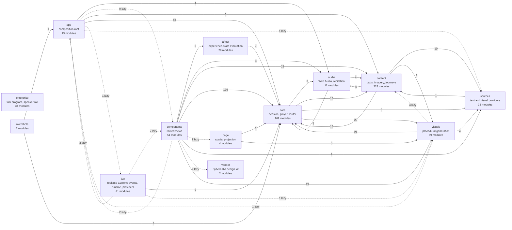

# RISE — system design

> The canonical, living description of how RISE is built and why it is built
> that way. There is one of these. If something here disagrees with the tree,
> **the tree is right and this file is a bug** — `src/core/system-design.test.js`
> exists to make that bug fail a build rather than mislead a reader.

**Scope.** Three things, in order: what the system *is* (§1–§6), the contracts
that constrain it (§7), and **every significant design decision with the
alternatives rejected and the tradeoff that decided it** (§8). §9 records what
this design costs, and §10 says how the document is kept true.

**When to update this file.** In the same change that alters a boundary, adds
or removes a room, changes a contract, or settles a decision in §8. Not after.

---

## 1. What RISE is

A browser-based audiovisual reader. Text is broken into **atoms** — a word, a
phrase, a line — each carrying a duration. A **Player** advances atoms against a
clock. A **Chamber** paints them over procedural or sourced imagery with a bed
of sound. The same compiled session can instead be projected into **Page**, a
spatial typographic composition. An **Experience Program** can author what
appears when.

Around that engine sit five rooms: Home, Read, Library, Make, Settings. Read
holds the reader setup, the Chamber and the live host as panes; the Library
opens the scripture, the liturgies, the journeys, the keystones and the day's
poem as panes; Make opens the Workshop, the Vault, the Scriptorium, the Visual
Lab and the Visual Catalog as tabs. The Guide is an overlay, not a room.

Cloudflare serves the app shell and the static catalog. The Library's optional
recommendation runs in the reader's browser, on the reader's own provider: it
reads the curated Standard Ebooks catalog (`/content/catalog.json`, §8.42) and
asks JEV to choose one book. The reader's source text, proposal validation, and
reading pipeline remain in the browser.

---

## 2. The three constraints that decide everything else

Every decision in §8 is downstream of these. They are the axioms; everything
else is a recommendation.

1. **No shared inference.** Every model call runs on the reader's own key or
   on the reader's own machine. RISE never pays for a reader's thinking.
2. **A browser, no account.** There is no identity service and no server-side
   reader state. Nothing a reader types or reads leaves their device unless
   they send it.
3. **Content is static and content-addressed.** Editions, recitation, imagery
   and programs are files named by their hash, built from a content branch
   into `dist/`, and never part of the module graph.

---

## 3. The diagram

```text
╔═══════════════════════════════════════════════════════════════════════════════╗
║                            RISE — SYSTEM DESIGN                               ║
╚═══════════════════════════════════════════════════════════════════════════════╝

  BUILD PLANE — run deliberately, by a person, never on a reader's request
  ┌─────────────────────────────────────────────────────────────────────────┐
  │  scripts/  (ingest · harvest · audit · catalog · voice · render · gate)  │
  │                                                                         │
  │   Standard Ebooks ─┐                                                    │
  │   Gutenberg ───────┼─▶ *-ingest.mjs ─▶ words-in == words-out ─▶ sha256  │
  │   Douay-Rheims ────┘         │              (refuses on mismatch)       │
  │                              ▼                                          │
  │   Met · AIC · NASA ─▶ *-harvest.mjs ─▶ contact sheet ─▶ HUMAN PIN        │
  │                                                                         │
  │   Kokoro TTS ───────▶ build-voice-pack.mjs ─▶ recitation Opus + manifest │
  │                                                                         │
  │   check-release-readiness.mjs  ── fails closed while any gate is open    │
  └────────────────────────────────┬────────────────────────────────────────┘
                                   │  emits JS modules + public/ assets
                                   ▼
  BUILD                     ┌──────────────────┐
                            │   vite build     │  Rollup follows dynamic
                            │   ~3 s           │  imports; no manualChunks
                            └────────┬─────────┘
                                     ▼
  DELIVERY   ┌──────────────────────────────────────────────────────────┐
             │  Cloudflare Worker · SPA rewrite · /assets/* immutable   │
             │  index.html no-cache — it names the hashed chunks         │
             │  CSP: self + named museum/text origins; no third-party JS │
             └────────────────────────┬─────────────────────────────────┘
                                      ▼
╔═══════════════════════════════════════════════════════════════════════════════╗
║  BROWSER — reading runtime; optional same-origin decision requests.           ║
║                                                                               ║
║   index.html ─▶ src/app.js  — composition root: boots app-scoped services,    ║
║                               injects operations into the route manifest       ║
║        ┌──────────────┬───────────────┬──────────────┬─────────────────┐      ║
║        ▼              ▼               ▼              ▼                 ▼      ║
║  ┌──────────┐  ┌────────────┐  ┌───────────┐  ┌────────────┐  ┌─────────────┐║
║  │  Router  │  │  Session   │  │  Player   │  │   Audio    │  │   Visual    │║
║  │ in-memory│  │  Compiler  │  │ the clock │  │  Engine    │  │   Cortex    │║
║  │ backstack│  │ THE ONLY   │  │ 5 states  │  │ Web Audio  │  │ the ONLY    │║
║  │ crossfade│  │ WAY IN     │  │           │  │ recitation │  │ flash       │║
║  └────┬─────┘  └─────┬──────┘  └─────┬─────┘  └─────┬──────┘  │ dispatcher  │║
║       │              │               │              │         └──────┬──────┘║
║       │              │               │              │                │       ║
║       ▼              │               ▼              ▼                ▼       ║
║  ┌─────────────┐     │        ┌────────────────────────────────────────────┐ ║
║  │   ROOMS     │     │        │  SURFACES                                  │ ║
║  │  Home       │     └───────▶│  Chamber (stream, in time)                 │ ║
║  │  Read       │              │  Page    (spatial, same Session)           │ ║
║  │  + its panes│              └────────────────────────────────────────────┘ ║
║  │  Library    │                                                             ║
║  │  + its panes│   each room is lazily imported with its own stylesheet      ║
║  │  Make       │                                                             ║
║  │  + its tabs │   ┌──────────────────────────────────────────────────────┐  ║
║  │  Settings   │   │  SOURCES  registry + providers + IndexedDB cache      │  ║
║  │             │   │  archive   (failure degrades one, not the app)        │  ║
║  │             │   │                                                       │  ║
║  │             │   │                                                       │  ║
║  └─────────────┘   └──────────────────────────────────────────────────────┘  ║
║                                                                               ║
║   STORAGE  localStorage (settings, journals, blueprints, images, orbital) ·   ║
║   IndexedDB (workshop media, personal swells, local works, source cache) ·    ║
║   flash consent is a ONE-USE IN-MEMORY capability, deliberately not           ║
║   persisted (§8.18).  src/core/user-data.js is the export and erase           ║
║   inventory — a store missing from it cannot be carried out or cleared.       ║
╚═══════════════════════════════════════════════════════════════════════════════╝
        │  anonymous · no-referrer · abort + timeout        ▲
        ▼                                                   │ failure ⇒ stillness
  ┌────────────────────────────────────────────────────────────────────────┐
  │  THIRD PARTIES  Met · Art Institute · Cleveland · Rijksmuseum.          │
  │  Pinned catalogs are preferred to live search; a live call is a         │
  │  convenience, never a dependency.                                       │
  └────────────────────────────────────────────────────────────────────────┘

  OFFLINE RENDER — a separate path, deliberately not the live one
  ┌────────────────────────────────────────────────────────────────────────┐
  │  Experience Program ─▶ compileRenderPlan ─▶ src/core/render/clock.js    │
  │  (rational frame index, NOT rAF) ─▶ Playwright Chromium paints the      │
  │  Chamber stage at explicit presentation times ─▶ ffmpeg H.264/AAC       │
  └────────────────────────────────────────────────────────────────────────┘
```

### The import graph, read from the tree

The diagram above is drawn: it says what the design is, and §10 checks the
claims in it that can be checked. This one is derived — `npm run docs:diagram`
reads every non-test module under `src/`, resolves its relative imports, and
writes what follows. It cannot disagree with the code, because the code writes
it, and CI fails when the committed copy is not what `src/` produces.

<!-- BEGIN GENERATED DIAGRAM: npm run docs:diagram -->


```mermaid
flowchart LR
    affect["affect<br/>experience-state evaluation<br/>29 modules"]
    app["app<br/>composition root<br/>13 modules"]
    audio["audio<br/>Web Audio, recitation<br/>11 modules"]
    components["components<br/>routed views<br/>51 modules"]
    content["content<br/>texts, imagery, journeys<br/>228 modules"]
    core["core<br/>session, player, router<br/>169 modules"]
    enterprise["enterprise<br/>talk program, speaker rail<br/>34 modules"]
    live["live<br/>realtime Current: events, runtime, providers<br/>41 modules"]
    page["page<br/>spatial projection<br/>4 modules"]
    sources["sources<br/>text and visual providers<br/>13 modules"]
    vendor["vendor<br/>SyberLabs design kit<br/>2 modules"]
    visuals["visuals<br/>procedural generation<br/>59 modules"]
    wormhole["wormhole<br/>7 modules"]

    affect --> |7| core
    app --> |1| audio
    app -.-> |9 lazy| components
    app --> |3| content
    app --> |43| core
    app -.-> |1 lazy| live
    app -.-> |1 lazy| sources
    app -.-> |1 lazy| visuals
    audio --> |1| content
    audio --> |6| core
    components --> |3| affect
    components -.-> |2 lazy| app
    components --> |3| audio
    components --> |23| content
    components --> |176| core
    components -.-> |1 lazy| page
    components --> |4| sources
    components -.-> |2 lazy| vendor
    components --> |19| visuals
    content --> |3| audio
    content --> |15| core
    content --> |10| sources
    content --> |1| visuals
    core --> |8| audio
    core --> |15| content
    core --> |4| sources
    core --> |20| visuals
    live -.-> |3 lazy| app
    live -.-> |2 lazy| components
    live --> |9| core
    live -.-> |1 lazy| visuals
    page --> |2| core
    page --> |3| visuals
    sources --> |1| content
    visuals -.-> |4 lazy| content
    visuals --> |21| core
    visuals --> |4| sources
    wormhole --> |1| app
    wormhole --> |2| core
```

Solid is a static import and travels in the first load; dashed is reached
only through `import()` and is deferred. The number on an edge is how many
imports it stands for. Generated by `npm run docs:diagram` — edit the
generator, not the diagram.

<!-- END GENERATED DIAGRAM -->

Layering is described here, not enforced: an edge is a fact, not a permission.
A dashed edge is the shape §8.24 argues for — deferred rather than deleted —
and it is the same set the first-load measurement prices.

---

## 4. The three planes

| Plane | Holds | Changes when | Shipped to a reader |
|---|---|---|---|
| **Control** | `src/` code — engine, rooms, surfaces, providers | a behaviour changes | yes, as hashed chunks |
| **Data** | works, chapel books, catalogs, recitation audio, pinned imagery | an editorial act occurs | yes; currently **through** the control plane (see §8.2) |
| **Build** | `scripts/` — ingest, harvest, audit, render, release gate | a process changes | no |

The build plane is the one that enforces the §2 constraints and the §7
contracts. Its refusals — word-count mismatch, missing rights basis, an
uncertified work on a public shelf — are the reason those constraints are
properties rather than intentions.

---

## 5. Boundaries

**`src/app.js`** is the composition root. It owns application-scoped services
and translates component events into navigation or session compilation.
`src/app/route-manifest.js` is the only module allowed to know every routed
room; it lazy-loads each room and passes only named capabilities. The immersive
session factory is a separate lazy module, so route extraction does not add its
player or visual machinery to first load.

Production exposes no application singleton on `window`. Development and the
browser suite may install the frozen seven-operation `window.__RISE_TEST__`
bridge from `src/app/test-bridge.js`; an ordinary production build does not
install it.

**`src/core/router.js`** owns crossfade transitions, view activation and
deactivation, the back stack, and failure restoration. Routed components must
make document-level listeners lifecycle-aware with `activate()`,
`deactivate()`, `destroy()`. A rejected async initializer must not leave the
transition lock held or the previous view hidden. Every route has a path,
declared once in `src/core/route-url.js`; old route ids remain valid as
aliases there. Read, Library and Make host their panes through
`src/components/room-panes.js`; the router updates such a room in place.

**`src/core/session-compiler.js`** is the only way a reading is built. Every
launch surface calls it. Do not recreate chunk or pacing logic in a component.

**The Current** is what every entrance arrives at: a compiled Session and the
Player that runs it. It is not a further type. `new Session` appears only in
the compiler and `new Player` only in `src/app/chamber-session-factory.js`,
and `src/core/current.test.js` fails if either appears anywhere else. The
reading that follows a division of a work is not copied field by field: every
field of a Session is classified in `src/core/session-successor.js` as
identity, source, or reading, and a field that is none of them fails a test.

The Current has one place: the head of the Stream, `player.sessionState
.currentIndex`. A projection is another way of looking at it. The Page opens
on the paragraph that holds the head (`PageReader.showAtom`, fed by the atom
range each text block carries), and nothing done in a projection moves the head,
because there is no seeking (LATERAL-TRAVERSAL-SPEC §1). The names
**Constellation** and **Stage** are reserved for projections that do not exist
yet.

Under a span of the reading's words there may be a thread: a gloss (written, by
the program's authority) or an echo (received: it stores no words and names
where the edition's are), both anchored to source text in the canonical
program's `thread` track, plus the image and sound the score already anchors
there. `src/core/undercurrent.js` gathers what lies under one atom. A dive
looks there: a hold is a glance, a tap an anchor (`src/core/dive.js`). It holds
the Player as pausing does and never moves the head, and it is offered only on a
reading that has threads.

A reading's pace has one vocabulary of profiles, `PACE_CURVE_IDS` in
`src/core/pacing.js`, and the compiler, the Reader Setup, the Workshop, saved
projects and the settings a reader keeps are each held to it by
`src/core/pace-profiles.test.js`. Jev's list is a smaller contract with the
Worker and must stay inside it. `breath` is the newest: atoms swell and ease
about every ten seconds, a whole number of cycles per reading, phased from the
authored clock so the reading is as long as it was. An atom at or near the
shortest an atom can be does not swell, so a reading too fast to swell is left
exactly as it was. It measures nothing about the reader.

**`src/core/player.js`** owns the authoritative reading clock and the playback
state machine: `idle`, `playing`, `paused`, `interlocuting`, `complete`.
`src/components/read/Chamber.js` renders and does not own the clock.

**`src/visuals/visual-cortex.js`** is the only flash dispatcher. It owns active
visual selection, decoded image pools, abort ownership on config change, the
execution-time consent and photosensitivity checks, and the presence lifecycle.

**`src/sources/registry.js`** owns provider discovery and initialization.
Provider initialization is retryable; registry initialization is idempotent; a
provider failure degrades that provider, not startup.

**Layering, checked by §10:** `src/core` and `src/visuals` never import from
`src/components`, statically or dynamically. Rooms communicate with the
application through callbacks passed in at construction.

**`src/enterprise/`** is a sibling of the reader, not a room. The reader does
not import it, and it imports nothing outside itself.
`src/enterprise/boundary.test.js` fails if either side reaches across. What a
speaker may see is admitted by the talk-program gate in that directory, not by
the Experience Program. §8.30.

### The rooms

Every place a reader can be. This list is checked against `src/components/`
in both directions by §10, so a room added without a line here, or a line here
outliving its room, fails a build.

| Room | Module | What it is |
|---|---|---|
| Home | `src/components/Home.js` | the hub, and the first screen |
| Read | `src/components/Read.js` | reading: the reader setup, a reading in time, and the live host, as three panes |
| Library | `src/components/Library.js` | the prepared editions, scripture, liturgies, journeys, keystones and the day's poem, with provenance on every edition |
| Make | `src/components/Make.js` | authoring: composition, saved work, the Scriptorium, the visual lab and catalog |
| Settings | `src/components/Settings.js` | preferences, affect, export and erase |

`src/components/Guide.js` is onboarding, opened as an overlay over any room
rather than routed; it is listed here because it is a place a reader can be.

Eight modules in `src/components/` are deliberately not rooms; they support
routed rooms: `src/components/Admit.js`,
`src/components/NamingModal.js`, `src/components/SourceBrowser.js` and
`src/components/VisualNavigator.js`, plus the Jev voice input helper
`src/components/jev-dictation.js`, the shared room frame
`src/components/room-chrome.js` (header, icons, Alert), the pane host
`src/components/room-panes.js`, and the SyberLabs
chrome helper `src/components/atlas.js`, which lazily imports the vendored
design-system kit in `src/vendor/syber/` (the ambient atmosphere behind Home
and the RISE sigil) so neither engine is part of first load.

Everything else in `src/components/` sits in a directory, by the room it
serves:

- `src/components/read/` is Read's panes and the engine's Stream projection
  (§8.45): `src/components/read/ChamberOrbital.js` (the reader setup),
  `src/components/read/Chamber.js` (a reading, in time) and
  `src/components/read/chamber-undercurrent.js` (the panel a dive opens). The
  live host is Read's third pane but lives in `src/live/host/`, outside the
  components, because it is a host for the live layer and not a room.
- `src/components/library/` is the Library's programs, panes it mounts rather
  than rooms (§8.43): `src/components/library/Chapel.js` (the scripture
  corpus), `src/components/library/Rosarium.js` (the Rosary, on the liturgy
  engine), `src/components/library/Via.js` (the Stations of the Cross),
  `src/components/library/Journeys.js` (authored long-form experiences),
  `src/components/library/Keystones.js` (the public entry corridor),
  `src/components/library/Mint.js` (the door a minted sequence opens onto) and
  `src/components/library/Curia.js` (the source and rights record).
- Today's poem has no pane: Home's card, its Menu and `/today` begin the day's
  exact poem in the reader through the app's `launchToday`, which
  `src/app/today.js` builds from `src/core/today-poem.js` and
  `src/core/today-reading.js`.
- `src/components/make/` is Make's tabs (§8.44):
  `src/components/make/Workshop.js` (authoring a composition),
  `src/components/make/Vault.js` (saved compositions and archetypes),
  `src/components/make/Scriptorium.js` (a model composes; a gate refuses),
  `src/components/make/VisualLab.js` (exploring, saving and reusing Living
  Flame scenes) and `src/components/make/VisualCatalog.js` (searching the
  procedural surfaces and opening admitted local live samples).
- `src/components/workshop/` is the Workshop's parts:
  `src/components/workshop/WorkshopStudioShell.js`,
  `src/components/workshop/StudioInspector.js`,
  `src/components/workshop/StudioTransport.js`,
  `src/components/workshop/ScoreCanvas.js`,
  `src/components/workshop/SceneStack.js` and its
  `src/components/workshop/scene-api.js`,
  `src/components/workshop/sequence-map.js`,
  `src/components/workshop/AssetLibrary.js`,
  `src/components/workshop/PassageAssignmentCard.js`,
  `src/components/workshop/workshop-ui-state.js` and
  `src/components/workshop/workshop-visual-assets.js`.
- `src/components/settings/` is the Emotions map
  (`src/components/settings/Emotions.js`, the optional affect map and
  inspectable list), the Affect section of Settings, mounted when its toggle
  is turned on; `/emotions` opens Settings with that section open.
- `src/components/visual-navigator/` is the Navigator's columns, text
  material, preview and Chapel trays, so `src/components/VisualNavigator.js`
  stays a mount point: `src/components/visual-navigator/directory.js`,
  `src/components/visual-navigator/text.js`,
  `src/components/visual-navigator/preview.js`,
  `src/components/visual-navigator/chapel.js`,
  `src/components/visual-navigator/markup.js`,
  `src/components/visual-navigator/live-stage.js` and
  `src/components/visual-navigator/world-stage.js`.
- Home opens on a reading already under way: `src/components/reading-backdrop.js`
  draws its engine, `src/components/reading-stream.js` streams its opening, and
  `src/components/home-ask.js` is the Ask for a reading dialog.

Every old route id and path still works: `src/core/route-url.js` maps each to
one of the five rooms, with the pane it opens named in `data.pane`. The Chamber
mounts a Fit-mask runtime from `src/core/fit-mask-runtime.js` rather than
owning the glyph-mask state machine.

---

## 6. One reading, end to end

```text
  a work is chosen
        ▼
  provider.get(id) ──▶ payload  (a dynamic import today — see §8.2)
        ▼
  session-compiler.js
        │  validate and bound input        50–1000 wpm · 2,000,000 chars/source
        │  chunk each source               MAX_CHUNK_WORDS 16 · PHRASE_FLOOR 5
        │                                  verse is READ from the edition
        │  attach source name and id to every atom
        │  insert timing-locked source boundaries
        │  apply the pacing curve           timingLocked atoms are exempt
        ▼
  Session { atoms[], totalDuration }   ── the source of truth for duration
        ▼
  player.js  ── advances atoms; a visual presence PAUSES the reading clock
        │        and is awaited; a rejected visual resumes without entering
        │        visible-duration accounting
        ▼
  Chamber (stream)  │  PageReader (spatial)   — same Session, two projections
```

---

## 7. Contracts that must hold

- **Reverent degradation.** A work, image or sound that will not resolve is
  *absent* — never a broken frame, never a substitute. Silence outranks
  approximation.
- **Provenance travels with the work.** A reader can always tell a received
  text from one written here, and every visual carries its rights. The build
  scripts refuse a work without a rights basis.
- **Structure is read, never inferred.** An ingest may not destroy a
  distinction the source made, and may not re-guess one it discarded.
- **A routed request carries only what the reader typed.** When the reader
  routes a Scriptorium request with JEV, only the intent they entered and the
  target word count are sent to the RISE function and TypeSafe; the reader
  supplies the key for that request and RISE never persists it.
- **Visual safety is an execution-time veto**, including when photosensitivity
  mode is enabled during a running session. Never auto-grant consent from a
  preset or a saved configuration.
- `VisualFlashGate` admits a presentation only within a visible-duty ceiling
  over a rolling window, and only after the previous presence has rested. A
  gate reservation is committed **only after the source renders**, so
  unavailable content consumes no cadence budget.
- **Treat as untrusted at every HTML or URL sink:** remote metadata, uploaded
  filenames, pasted text, saved browser data. Prefer `textContent`; use
  `escapeHtml` and `safeUrl` only where templating is unavoidable.
- **Network and worker failure must produce bounded stillness or a local
  fallback**, never an unbounded playback stall.
- **A new personal store is added to `src/core/user-data.js` in the same change
  that introduces it.** A store missing from that inventory is data export
  cannot carry out and erase cannot clear.

---

## 8. Decisions, and the alternatives rejected

The format is fixed and checked by `src/core/system-design.test.js`: every
entry states **Chosen**, **Rejected**, **Why**, and **Status**. `Status` is one
of `settled`, `open`, `deferred`, or `reversed`.

### 8.1 No backend

- **Chosen:** the browser is the entire reading runtime. A Cloudflare Worker
  serves the static files and the reader's own-key integrations, and holds no
  reader state.
- **Rejected:** a server tier with accounts, sync, and server-side identity.
- **Why:** the tradeoff is unusually lopsided. A backend buys cross-device sync,
  real access control, server-side rate limiting toward museum APIs, and
  telemetry. It costs the §2.2 constraint outright — "nothing leaves" stops
  being a property of the architecture and becomes a promise about conduct —
  and it imports availability, consistency, replication, authentication,
  authorization and an operational budget into a project that currently has
  none of those problems. A CDN already scales to any readership without a
  design change. **The one thing genuinely lost is real access control**, and
  that loss is accepted and named in §9 rather than hidden.
- **Status:** settled.

### 8.2 Content is data, addressed by its own hash

- **Chosen:** a work is a content-addressed asset. `content/manifest.json`
  (schema `rise.content-manifest.v1`) names every work; the payload lives at
  `content/works/<sha256>.json` and is fetched at read time by
  `src/core/content-store.js`, which verifies the digest on arrival. **The hash
  is the URL**, so the address an object was fetched by is the digest it must
  have.
- **Rejected:** generated `.js` modules under `src/content/`, reached by dynamic
  `import()` from a catalog — which is what this was until it was cut.
- **Why:** compiling books bought one real thing — Rollup hashed, split and
  cache-busted payloads for free, and a missing import was a build error rather
  than a 404. It cost far more. The JavaScript compiler parsed novels; the
  repository carried the corpus; a test fork needed a raised heap ceiling to
  compile a single book; and a withheld work had to be unlinked from the
  catalog or the bundler shipped it anyway — the defect that once built and
  deployed 82 MB of unreachable books. Measured at the cut: shipped JavaScript
  fell from 18.7 MB to 3.25 MB with **no book text left in it at all**, and
  first load fell to 58.8 KB brotli over three requests.
  **What the old design could not buy at any price** is what this one gets for
  nothing: a payload is re-verified in the reader's browser on every read, so a
  silently corrupted object is unreadable rather than readable-and-wrong. A
  work that will not verify is *absent*, per §7 — never substituted.
- **Status:** settled. Recorded as `open` when this register was written, and
  closed by the change that cut the seam.

### 8.2a Withholding is a manifest field, not a code path

- **Chosen:** a withheld work appears in `content/manifest.json` with
  `shelved: false` and its `withheldReason`, and its payload is simply not
  addressed.
- **Rejected:** the earlier mechanism, where a withheld work carried metadata
  but no `load` function, and a test asserted that correspondence in both
  directions.
- **Why:** that test — `reachable-payloads.test.js` — existed to stop the
  bundler shipping something a runtime filter could not remove. Once content is
  not built, the bundler is not on the path, and the defect it guarded is not
  merely fixed but **impossible**. Deleting a test because its subject ceased
  to exist is the strongest available form of a fix, and is why the deletion
  appears in the same change as the seam. `content-manifest.test.js` replaces
  it, asserting what is now true: every shelved work resolves, and every
  withheld one states a reason.
- **Status:** settled.

### 8.3 A withheld work is unlinked, not deleted

- **Chosen:** a withheld work keeps its metadata, provenance and a stated
  reason. The payload stays on disk and in git.
- **Rejected:** deleting the payload.
- **Why:** a withholding is an editorial act, and it must stay reversible and
  legible to a future curator — "withheld, never deleted," with every
  withholding stating a reason, enforced by test. The *mechanism* for keeping a
  withheld work off the wire has changed twice and is recorded in §8.2a; the
  rule about not destroying the payload has not changed at all.
- **Status:** settled.

### 8.4 No `manualChunks`

- **Chosen:** Rollup's default splitting, which follows the dynamic imports we
  write.
- **Rejected:** named cache groups for large subsystems.
- **Why:** it was a grouping directive read as a deferral one. Naming a module
  there makes it a dependency of the **entry**, so the shell emits a
  `modulepreload` and the browser fetches it before the reader has chosen
  anything — the audio engine kept being preloaded after `app.js` was changed
  to import it dynamically, because the list still named it. It also suppressed
  Rollup's own "dynamic import will not move module into another chunk"
  warnings, which are the report that a deferral has been defeated. Measured
  worth of the whole mechanism: three kilobytes.
- **Status:** settled.

### 8.5 Recitation is a pre-built voice pack, not runtime TTS

- **Chosen:** Kokoro runs at build time; the deployed app plays same-origin
  audio addressed by normalized phrase text. Today's poem uses a vendor voice
  (ElevenLabs v4) under the same rule: rendered once by the author, cut into
  per-line AAC `.m4a` clips, one small pack per poem named by
  `recitation.pack`. No vendor is called at runtime.
- **Rejected:** running the model in the reader's browser — and this one was
  *measured* before it was rejected, not assumed. The browser path was built
  and tried: `speechSynthesis` is a formant synthesiser and was never a
  candidate; q8 WebAssembly ran at a real-time factor of 2.6–3.0 against a
  budget of 0.75; q4f16 produced non-finite samples; the WebGPU path produced
  numeric explosions large enough that the code now rejects WebGPU before
  encoding. The record is kept in `docs/vision/RECITATION-SPEC.md` rather than
  deleted with the code.
- **Why:** beyond the measurements, runtime inference would need a model host,
  a WebAssembly policy exception and a large first-run download, and would make
  a reading depend on a third party. Pre-building keeps the CSP free of any
  script or WASM exception and makes recitation byte-identical and certifiable
  — the acoustic ledger binds a human verdict to exact audio bytes, which
  runtime synthesis could not support. The governing rule was written as
  "treat speech as unavailable rather than choosing a backend by feature
  detection alone," which is §7 applied to sound. **The cost was size**: the
  packs shipped as uncompressed WAV, about 239 MB; they are now Ogg Opus at
  64 kbps, about 23 MB.
- **Status:** reversed. Reversed 2026-10: recitation is Opus at 64 kbps; §9's largest cost is gone.

### 8.6 MP4 render is an offline Node path, not in-browser capture

- **Chosen:** a plan is compiled, Playwright Chromium paints the Chamber stage
  at explicit presentation times, ffmpeg encodes.
- **Rejected:** `MediaRecorder` or WebCodecs capturing a live session.
- **Why:** capture records whatever the machine managed to draw, so the artifact
  depends on the recording machine's load. The offline path advances a
  deterministic rational frame clock (`src/core/render/clock.js`, explicitly
  *not* `requestAnimationFrame` and *not* `AudioContext.currentTime`), so the
  same program yields the same frames. The cost is that render is not available
  to a reader in the browser: the production build carries no write path, and
  the Workshop hands out a job description for the CLI instead.
- **Status:** settled.

### 8.7 The live path has many frame loops; the render path has one clock

- **Chosen, for now:** `Player` owns the reading clock; each persistent visual
  field runs its own `requestAnimationFrame` loop.
- **Rejected so far:** one scheduler with subscribers and a single
  `sessionTime`.
- **Why:** each engine was written to own its own animation, and nothing forced
  a shared timeline. The cost is that nothing can answer "what time is it" for
  a session as a whole, and a rendered MP4 and a live reading of the same
  session run on different notions of time. The deterministic clock the live
  path lacks **already exists** in the render path.
- **Status:** open.

### 8.8 Pinned catalogs are preferred to live museum search

- **Chosen:** imagery is harvested offline, reviewed on a contact sheet, and
  pinned. Live API calls are a convenience.
- **Rejected:** live search against museum APIs as the primary path.
- **Why:** live search cannot be rate-limited across readers, cannot be
  rights-checked before display, and puts a third party on the reading path.
  Harvest-and-pin means a human approved every image and its rights before a
  reader could meet it, which §7 requires. Two rejections are recorded with
  their evidence: the Wikimedia category registry is **empty by design** after
  an audit found a category silently returning nothing for its whole life —
  "a searched source can rot invisibly, and a pinned one cannot" — and the Met
  provider was retired because its public API serves roughly 750-pixel
  derivatives over pools too shallow to hold a reading. The cost is a smaller,
  slower-moving collection.
- **Status:** settled.

### 8.9 Fifteen certified editions, not eighty-eight acquired ones

- **Chosen:** a small shelf chosen as acceptance fixtures for textual *forms* —
  epic, drama, lyric, wisdom, essay, novel — each ingested structure-preserving
  and certified end to end.
- **Rejected:** the accumulate-then-clean loop that produced eighty-eight
  Gutenberg works.
- **Why:** the old loop was acquire → ingest → find garbage → write a detector →
  clean → find different garbage. It could not terminate, because a detector
  registry finds only what a signature already describes: "every detector
  reports zero" gets *weaker* as you learn more. A canon of favourites proves
  nothing; a canon of forms proves the instrument. The cost is a catalogue small
  enough to look unfinished, accepted deliberately.
- **Status:** settled.

### 8.10 Vanilla DOM, no UI framework

- **Chosen:** direct DOM construction and template strings, one bespoke module
  per room, four production dependencies: `sql.js` for browser-local work,
  and `@ai-ecoverse/kev.js`, `onnxruntime-web` and `@huggingface/tokenizers`
  for on-device Kev, imported only by the EnterpRise worker that runs it
  (§8.32). The tokenizer already shipped inside kev.js; it is named because
  the worker builds Kev's session itself.
- **Rejected:** React, Vue, Svelte or any virtual-DOM library.
- **Why:** the tradeoff is real in both directions. A framework would give
  declarative rendering, diffing, and would largely remove the `innerHTML`
  surface that currently requires `escapeHtml` discipline at every sink. It
  would cost a dependency, a rewrite of every room, and a rendering model
  between the author and the paint — in a project whose whole subject is
  precise control of what appears when. The recorded defects in this codebase
  have been structural, not rendering bugs.
- **Status:** settled, and revisited if the `innerHTML` surface ever produces a
  real defect rather than a theoretical one.

### 8.11 JavaScript, not TypeScript

- **Chosen:** plain JavaScript with JSDoc where it helps.
- **Rejected:** a TypeScript migration.
- **Why:** types would catch a class of error this project has not been making.
  Its expensive defects have been a vocabulary living in two places, a guard
  that could not fail, structure destroyed at import, and a build-time
  dependency a runtime filter could not remove — none of which a type system
  sees. The cost of migrating is a six-figure line change across the tree.
- **Status:** settled for now; the reasoning is about observed defect classes,
  so new evidence should reopen it.

### 8.12 In-memory routing; almost nothing has a URL

- **Chosen:** a view registry with a back stack. Three things have real
  addresses: the Keystone corridor, the rosary door, and `/p/<slug>` for a
  minted sequence.
- **Rejected so far:** URL-addressable rooms.
- **Why:** no reason recorded in the tree — the router was built for
  transitions, and addresses were never required. The cost is that most of RISE
  cannot be linked to, browser Back does not meaningfully work inside a room,
  and a reload lands on the Portal. `handleNavigate` already pushes history for
  one corridor, so the mechanism exists.
- **A MINTED SEQUENCE IS AN ADDRESS BECAUSE IT HAS TO BE.** It exists to be
  printed on a card and scanned, which is a URL and nothing else. It is a
  third narrow case rather than the general regime this entry still rejects:
  the register in `src/content/programs/` is an allowlist, so the address
  names a mint rather than naming a file.
- **AND IT RESOLVES TO A THRESHOLD, NOT TO A READING.** The same rule the
  Keystone corridor follows, for a reason worth stating: a reading begun from
  a cold address bar begins with no user activation, so the browser refuses
  the audio and the first phrase is silent, and every safety notice is stepped
  over on the way. The button on the threshold is the gesture the audio
  lifecycle is waiting for.
- **Status:** reversed. Reversed 2026-10: every room has a path in
  `src/core/route-url.js`; a reading can be bookmarked and shared, and Back
  works everywhere, not only on the Keystone paths. The minted `/p/<slug>`
  threshold and the Rosary hash door keep their own cold-load handling.

### 8.13 jsdom for the suite; real browsers for what jsdom cannot see

- **Chosen:** Vitest on jsdom for the unit suite, plus a Playwright browser
  suite, plus two unit tests that use real system tools — one hands bytes to a
  real ffmpeg, one paints a live Chamber stage in real Chromium.
- **Rejected:** a stub for either of those two.
- **Why:** "a stub would only prove we can satisfy our own stub." Those two
  tests are the reason CI can claim an MP4 can be produced and a frame can be
  painted at all. The cost is that the runner must install ffmpeg and Chromium,
  and that jsdom remains a weak substrate for Web Audio, IndexedDB, device
  pixel ratio and real animation frames.
- **Status:** settled; broadening the real-browser layer is open.

### 8.14 A fork's heap ceiling is named, not inherited

- **Chosen:** test forks start with an explicit `--max-old-space-size`.
- **Rejected:** scaling worker count against system memory.
- **Why:** it could not have worked — what kills a fork is its own V8 old-space
  limit, and no number of workers changes that limit. The suite passed on a
  workstation and died on CI over nothing either machine was short of, because
  Node 20 and Node 22 default that ceiling differently. Naming it removes the
  dependence on which Node picked the number.
- **What this entry predicted, and got wrong.** It said the cap was raised
  around a cause that was still there: V8 died in
  `CompilationCache::LookupScript → String::SlowFlatten`, flattening a module's
  source text to compile it, and the modules that size were the books — so the
  ceiling was expected to come down once §8.2 removed them from the module
  graph. §8.2 resolved, the books left, **and the ceiling is still needed.**
  Measured rather than assumed: a fork capped at 2048 still dies, and the stack
  is now an ordinary incremental-marking failure under the event loop.
  Removing the books removed one file's ability to fill a heap by itself; it
  did not change what a fork accumulates across the files it is handed.
- **Status:** settled. Do not delete this on the theory that §8.2 made it
  unnecessary — that theory was tested and is false. The test is one command:
  cap a green run at 2048 and see whether it is still green.

### 8.15 Release admission fails closed, and humans hold the last gate

- **Chosen:** `npm run release:check` is a single admission report that exits
  nonzero while any machine-verifiable *or declared human* gate is open.
  Certification is bound to bytes and withdrawn automatically by re-ingest.
- **Rejected:** treating a green build as sufficient.
- **Why:** "a green build is necessary, never sufficient." Editorial,
  acoustic, device and comprehension judgements cannot be automated, and a
  suite that passed would otherwise imply they had been made. The cost is that
  the public debut is blocked on human throughput, which is the real critical
  path today and is stated as such rather than engineered around.
- **Status:** settled. Do not weaken the checker to obtain green; close the
  named evidence gap.

### 8.16 A deploy must not strand an open tab

- **Chosen:** a `vite:preloadError` listener and a router check treat a failed
  chunk import as a stale build and reload **once**, guarded by a sentinel;
  `index.html` is served `must-revalidate`.
- **Rejected:** letting the tab break, and reloading unguarded.
- **Why:** `index.html` names the hashed chunks, so a tab left open across a
  release asks for a file the new deploy replaced, gets a 404, and can no longer
  reach any view it had not already loaded. A stale chunk is not a transient
  network error and retrying cannot fix it. The sentinel exists because an
  unguarded reload turns a real network failure into a loop.
- **Status:** settled.

### 8.17 The catalogue is derived at build time

- **Chosen:** `scripts/build-division-index.mjs` precomputes division structure;
  withheld divisions go to a separate file nothing shipping imports.
- **Rejected:** deriving divisions in every browser.
- **Why:** it lets a card say how many chapters a work has without downloading
  the work. Labels are verified against the divided text rather than against
  counts, because a count-only check passed while chapter labels drifted and
  broke Scriptorium navigation.
- **Status:** settled.

### 8.18 Visual consent is one-use and in memory

- **Chosen:** consent to flashing imagery is an in-memory capability for one
  presentation.
- **Rejected:** the former browser-session grant held in `sessionStorage`.
- **Why:** a persisted grant means a reader who consented once meets flashing
  imagery later without being asked, including in a room they did not consent
  in. `sessionStorage` is now only ever *cleared*, never written. Consent is
  also never auto-granted from a preset or a saved configuration (§7).
- **Status:** settled.

### 8.19 A deleted room keeps its data

- **Chosen:** when a room is deleted, its persisted keys and data namespaces
  stay. The Solarium is gone and `rise_sol_plan_v1` remains in
  `src/core/user-data.js`; the Atrium room is gone and its `atr-` accession ids
  and `atriumCollections` field remain.
- **Rejected:** deleting the keys with the room.
- **Why:** "a key dropped from that registry is data that export cannot carry
  out and erase cannot clear" — a reader who planned a day in the Solarium
  still has one saved. Renaming a persisted key is a migration, not a cleanup,
  **and doing it inside a deletion is how a deletion becomes an outage.** The
  key is removed when nobody can still be holding one, which is not the same
  day the room goes.
- **Status:** settled.

### 8.20 One source of truth for a limit

- **Chosen:** `src/core/reading-limits.js` holds the pace bounds, and every
  surface imports them.
- **Rejected:** each surface carrying its own slider range.
- **Why:** a reader who chose 60 wpm was silently overridden to 100, because a
  narrow window was the min and max of one modal's slider, copied twice. This
  is the defect class that recurs most in this codebase — a vocabulary living
  in two places where only one learns a new word — and the standing rule is to
  prefer deleting one copy to synchronising two. Where duplication is
  unavoidable, a test asserts the two agree, which turns silent drift into
  loud failure.
- **Status:** settled.

### 8.21 The public shelf serves candidates, and says so

- **Chosen:** `RELEASE_SERVES_UNCERTIFIED` is `true`, written in source rather
  than a build flag, and the shelf tells the reader a work is a candidate.
- **Rejected:** failing closed until certifications land.
- **Why:** failing closed was the right default and the wrong outcome — nothing
  has ever been certified, so the public shelf served **nothing** while
  development served everything. Putting the override in source rather than in
  an environment variable means it is visible in review and cannot be set
  accidentally by a deploy.
- **Status:** open, and explicitly temporary. Set it to `false` the day the
  certifications land.

### 8.22 Gallery is the default visual surface

- **Chosen:** a reader who has expressed no preference gets Gallery —
  continuous imagery behind the text.
- **Rejected:** rhythmic full-frame flashing as the default.
- **Why:** Gallery is the only surface that never flashes and never goes black,
  so it is what an unasked reader should meet, and it needs no consent prompt.
  Raising a photosensitivity warning over a surface that does not carry the
  risk asks a reader to accept a danger that is not there. A domain that
  authors its own surface — a Chapel book, a program saved in Make's Vault —
  still wins, per the three-layer law: content authors, the runtime follows,
  the cortex renders.
- **Status:** settled.

### 8.23 Production carries no write path

- **Chosen:** the Curia apply endpoint and the MP4 export endpoint are Vite
  plugins with `apply: 'serve'`, so they exist only on the dev server.
- **Rejected:** shipping write endpoints with the static build.
- **Why:** a static deploy with no write path cannot be made to write. The cost
  is that the Workshop's export hands a reader a job description for the CLI
  instead of a file, which §8.6 already accepts.
- **Status:** settled. Production also ships no source maps, to keep the bundle
  opaque.

### 8.24 Deferred rather than deleted

- **Chosen:** Journeys are on ice — the published list is empty while the
  scores, tests and compiler stay. RISE Chain stays out of production.
- **Rejected:** re-anchoring Journey scores quickly, and shipping Chain under
  release pressure.
- **Why:** Journey scores quote editions the canon no longer serves, so their
  anchors broke — correctly. **Re-authoring someone's score against a new
  translation is an editorial act, not a repair.** Chain was held back because
  production pressure would immediately impose questions of attribution,
  moderation, and whether generation could accidentally reproduce long source
  passages — questions better answered before readers than after.
- **Status:** deferred.

### 8.25 The licence boundary is drawn by bytes, not directories

- **Chosen:** code is Apache 2.0; authored strings, curated selections and
  names are reserved; visual engine *output* is not reserved separately from
  the engine.
- **Rejected:** splitting the licence by directory, and reserving procedural
  output as composition.
- **Why:** the directory split "got two answers, which is the same as getting
  none," because a directory holds both code and authored text. Reserving
  engine output was dropped on the reasoning that **a grant to run and modify
  the engine is a grant to the images it draws** — claiming otherwise while
  licensing the engine Apache would be incoherent.
- **Status:** settled.

### 8.26 The doorway is a preset over the engine, not a second engine

- **Chosen:** a stance (`src/core/stances.js`) is a named partial of the
  configuration Read's setup pane (the Orbital) already builds. It writes
  fields in the visual, audio and temporal orbits, and what it emits takes the
  same road as a hand-built configuration: the Orbital's persistence
  normalizers, then
  `normalizeVisualConfig` in the session compiler. Which stance a reader is
  standing in is derived from the configuration, never stored.
- **Rejected:** a simplified reading mode with its own path to the cortex; and
  hiding the orbits behind the stance row.
- **Why:** the parameters are not the problem — meeting forty of them with no
  orientation is. A second path would double the validation surface that
  §7 depends on, for a layer whose entire job is to *name* points in the space
  the validators already police. Storing the chosen stance was rejected for a
  smaller reason with the same shape: a remembered choice would keep claiming a
  posture the reader had adjusted away from, so the row would lie. Deriving it
  cannot. There is no `study` stance yet; it is the entry to Page mode, which
  is sequenced after this step.
- **Status:** settled.

### 8.27 Application capabilities are injected, not discovered

- **Chosen:** `src/app.js` owns application state, `src/app/route-manifest.js`
  owns the fixed lazy route table, and rooms receive the exact callbacks or
  instances they use. Browser automation gets a frozen seven-operation bridge
  only in development or an explicitly flagged test build.
- **Rejected:** a production `window.rise` singleton, room code reaching back
  through `globalThis`, and a generic service bag passed into every room.
- **Why:** a room that discovers its host through a global hides its inputs,
  makes isolated tests lie, and lets unrelated code mutate the whole
  application. Named capabilities make ownership visible at construction. The
  narrow test bridge preserves observability without making automation access
  part of the production product surface.
- **Status:** settled.

### 8.28 JEV routes the Scriptorium's proposal format

- **Chosen:** the Scriptorium offers an optional JEV route to choose between
  the two proposal formats RISE already accepts:
  `rise.experience-program.v1` and `rise.agent-operation-set.v1`. The core
  session puts that choice into the curator prompt. A same-origin Cloudflare
  Worker route forwards only the reader's intent and target word count to
  TypeSafe's JEV API; the reader supplies the API key for the request.
- **Rejected:** putting the TypeSafe key in browser code, adding a second
  proposal format, or letting JEV accept or execute the proposal.
- **Why:** proposal format is a real next-operation choice already understood
  by the Scriptorium parser and producer. This places optional JEV routing in
  the authoring flow while keeping its decision bounded by RISE's existing schemas
  and validation. JEV's choice is a routing recommendation; deterministic
  parsing, source resolution, producer checks and the reader's Begin action
  retain their existing authority.
- **Data boundary:** no source text, Library records, personal media, reading
  history or generated proposal is sent to JEV by this route. The user-entered
  intent may itself contain personal information and is sent only after the
  reader presses **Route with JEV**. The TypeSafe key is held in page memory
  and forwarded in the authorization header; RISE does not store it.
- **Status:** open. The route exists in the Worker; each reader must supply a
  TypeSafe API key, and the production path still needs direct verification.

### 8.29 JEV chooses a held Standard Ebooks reading

- **Chosen:** an optional Library form sends the reader's intent to JEV from
  the reader's browser, on their own account. The browser reads the
  exact-edition catalog from the static file (§8.42) and asks JEV to choose one
  work ID. It opens that held edition through the existing Library path. (This
  once ran in the Worker, reading PostgreSQL through a Redis cache; §8.42
  retired that path.)
- **Rejected:** sending book text or personal reading history to JEV, storing
  raw intents or decisions in PostgreSQL, inventing a recommendation from local
  heuristics when JEV fails, and accepting a model-selected unheld edition.
- **Why:** a recommendation is useful only when it leads to a book the reader
  can actually open. The catalog file bounds the choice, and JEV makes it. Exact edition
  and source revision checks keep the model inside the release inventory. The brief
  description shown after the decision is curated catalog copy; JEV does not
  generate prose.
- **Status:** settled. The recommendation runs in the reader's browser; the
  Worker caches no decisions, and the catalog is a static file (§8.42).

### 8.30 EnterpRise is a sibling rail, not a fork of the reader

- **Chosen:** the live room lives in `src/enterprise/`. One deck, an in-memory
  corpus of documents and tables, cards prepared before the talk, one speaker
  rail, and one stage. Promote re-checks the talk-program gate for that room's
  audience. An audience final that misses the program may retrieve a permitted
  sentence onto the rail. Listed presenters share the rail. A decision sees
  the transcript window plus candidate ids, titles, scores, and layouts. A
  chart names a table and columns; the renderer copies cells. Promote, Dismiss,
  and Retract are the speaker's.
- **Rejected:** forking the reader into a second app; extracting Chamber, the
  Experience Program, and the Worker into a shared package; putting the rail
  inside a reader route; mounting Chamber on the stage; a second rail; an
  external file-host connector; an OpenRouter call on the enterprise decision
  route.
- **Why:** the failure that matters is a confidential document, or a number
  that was not in the source, in front of the room. The gate, the id-only
  decision, and the cell renderer make that failure loud. The phases in
  `docs/superpowers/specs/2026-09-27-enterprise-room-design.md` are implemented
  in `src/enterprise/`, from
  `docs/superpowers/plans/2026-09-27-enterprise-room.md`. The reader's lack of
  access control (§8.1) is unchanged: this audience check belongs to the
  sibling, and the sibling is not on the reader's first load.
- **Status:** settled, except the rejected provider call on the enterprise
  decision route, which §8.31 reverses. The suite's latency ceilings are the
  product targets on this fixture, not a measurement of a live recognizer.

### 8.31 The live room decides through JEV and holds on any doubt

- **Chosen:** the room listens through the browser recognizer. Interim speech
  warms the lexical tier; a final, or the presenter's typed Ask, asks for a
  decision. `session.prepare`
  builds a `rise.enterprise-context.v1` (`src/enterprise/context.js`):
  evidence (window, speaker, mode), structure (candidate ids, titles, scores,
  layouts; rail ids and titles), and authority (the actions this turn allows,
  never promotion). The live loop (`src/enterprise/live.js`) keeps one
  decision in flight per channel (speech, ask), cancels it only when a newer
  turn on the same channel arrives, and bounds it with a timeout. `/api/enterprise-decision` joins the other decision routes
  behind `decisionProvider` and the limiter and asks the provider one choice
  question whose options are opaque keys. `session.resolve` accepts an answer
  only for a turn it issued, once, while no later turn on its channel is
  pending. The
  trace (`src/enterprise/trace.js`) records every step without the
  transcript. The rule decider remains for tests and an explicitly chosen
  local mode.
- **Rejected:** falling back from a failed JEV decision to rules; letting the
  provider name a card id or write text; sending documents, tenants, or the
  audience to the route; deciding on interim speech; a speech vendor SDK; a
  server-side trace store; a vector store.
- **Why:** the model is useful for choosing which permitted card fits what
  was just said, and harmful anywhere else. Every failure mode — timeout,
  cancellation, a late answer, a malformed answer, an outage — resolves to
  the rail as it was, and the stage still moves only on a presenter's tap
  after the gate runs again. Spec:
  `docs/superpowers/specs/2026-09-28-enterprise-live-loop-design.md`.
- **Status:** open. The loop, route, and page are verified with a scripted
  recognizer and routed decisions. A live Kev or Jev decision on the
  deployed room, and field latency from a real microphone, are not yet
  measured.

### 8.32 Kev can decide on the presenter's own GPU, in the browser

- **Chosen:** a third decider, "Kev (device)", runs Kev through WebGPU with
  `@ai-ecoverse/kev.js` and `onnxruntime-web` in a dedicated worker
  (`src/enterprise/kev-worker.js`). It asks the same question and reads the
  answer the same way as the server route (`src/enterprise/rail-question.js`).
  `src/enterprise/device-model.js` pins what may load: a manifest naming any
  checkpoint but the pinned one is refused before weights are fetched, and the
  runtime binary must match the digest of the lockfile's copy. The model
  downloads only when a presenter chooses it. Until it is ready, or after it
  fails, decisions hold. The worker script alone may fetch model hosts and
  compile WebAssembly: the Cloudflare Worker serves it with its own policy
  (`worker/kev-worker-script.mjs`), and every page keeps the site policy in
  `public/_headers`.
  `kev-check.html` measures load, latency, and agreement on a real device.
  The weights never sit whole in the worker: each file streams into Cache
  Storage (`src/enterprise/kev-store.js`) and reaches the runtime as a
  disk-backed Blob, which the JSPI build of `onnxruntime-web` reads one
  tensor at a time on its way to the GPU. A browser without JSPI loads
  nothing.
- **Rejected:** a local Python service for Windows users (CUDA, WSL2, and a
  localhost port every site could reach); falling back to the server or the
  rules when the device cannot run Kev; the CPU WebAssembly path, too slow for
  a live rail; fetching the runtime binary from a public package host, which
  put a third party in the load path of a binary this site can serve itself
  (the JSPI build is 16.8 MB, under Cloudflare's 25 MiB static asset limit,
  and `vite.config.js` fails any build that emits a larger file); kev.js's
  own `loadKev`, which reads every weight
  file into memory before the session exists and crashed the tab loading
  Kev-4B's 4.7 GB on a 16 GB Windows machine.
- **Why:** the transcript and the decision stay on the presenter's machine,
  with nothing to install. Kev-4B on the device is pinned to the checkpoint
  the local server Kev serves (`deploy/kev/local_app.py`), and a test keeps the two
  pins equal.
- **Status:** open. Kev-0.8B loads and decides on Chrome 153 for Windows with
  an AMD RX 5700 (30 of 30 questions, 214 ms median). While a model is
  loaded, Chrome's GPU process holds system memory about 1.4 times the
  model's size, so Kev-4B needs roughly 6 GB of free memory; it has not yet
  been run on Windows. Hosts other than the Cloudflare Worker serve the
  worker script with the site policy, so Kev (device) fails closed there.

### 8.33 One reading, many entrances: the Current

- **Chosen:** RISE is one instrument that turns any source into a compiled,
  paced, time-based reading, the Current. A room is an entrance (it chooses a
  source, a pace and layers and hands them to `compileSession`), a contributor
  (it adds a source, a layer, a projection or a pace), or a rail beside the
  reading (the Library's provenance pane, Settings). The two constructors are guarded by a test, every
  entrance's output is checked against one contract, and the reading that follows
  a division is derived from the Current by classifying each Session field
  rather than by copying a list.
- **Rejected:** a new Current type beside Session (a second vocabulary for the
  same object); folding the Rosarium and Via into it, which run their own fixed
  clock by covenant and must not gain a layer, a dive or an affect signal;
  keeping the hand-copied field list, which drops any field the Session learns
  later without saying so.
- **Why:** every entrance already converged on one compiler, so the work was to
  make that convergence something a test can break. The successor list was the
  one place the reading was rebuilt by hand, which is the defect of a
  vocabulary in two places where only one learns a new word.
- **Status:** open. Guards, the successor, one place for the reading, threads
  under a passage, dive and surface, and the breath pace are built. Emotions, as
  a projection, and Confluence follow. The plan is
  `docs/plans/CURRENT-CONSOLIDATION.md`.

### 8.34 A live Current is events that lower to the sealed one

- **Chosen:** `src/live/` is a layer above the sealed `rise.current.v1`. A provider,
  behind an adapter, yields `rise.current-events.v1` events; a pure reducer
  (`src/live/stream.js`) orders and bounds them and lowers the words that have
  ended to a sealed Current, which `compileRiseCurrent` turns into the one
  Session for the one Player. Nothing below `live` imports it, and it reaches
  only `core` and `audio` (`src/live/boundary.test.js`); a host loads it with
  `import()`, so first load is unchanged.
- **Rejected:** widening `rise.current.v1` to carry realtime; a second player for
  live readings; letting provider events reach the runtime; a renderer,
  shader, style or URL field a model could fill; building the demo as a room.
- **Why:** committed words are immutable, so each lowering is a prefix of the
  next and the Player can be extended without being replaced. A protocol whose
  every field is named and bounded gives a provider nothing executable to send,
  and a reducer that spends a malformed event's sequence number cannot be
  stalled by one. The plan is `docs/plans/LIVE-CURRENT.md`; the contract is
  `docs/specs/LIVE-CURRENT-EVENTS-V1.md`.
- **Status:** open. The protocol, the reducer, the adapter boundary, a
  deterministic mock and a conformance suite every adapter must pass are built
  and unit tested, and the one Player has a live mode (`setLive`, `extend`): it
  holds at the end of its words, takes no reading time while it waits, and is
  extended by a longer Session whose earlier atoms are unchanged. The runtime
  (`src/live/runtime.js`) drives it: it reads a provider's events into the
  reducer, lowers each ended segment into the one Player, and lets a voice
  renderer be the clock (`speech-governor.js`) while a voice speaks. A Dive holds
  the parent's Player and voice, runs a Current of its own, and Surface lets the
  parent go from the same atom. Speech belongs to the runtime, not the provider,
  and what the reader lived through is kept in the runtime's journal, because
  the reducer's stream is sealed at `current.complete`, long before speech
  ends. The host at `/live` (`src/live/host/`, deliberately not in
  `src/components/`, because it is a host and not a room; Read mounts it as its
  live pane, §8.45) presents the reading in Read's chamber pane: the factory adopts the Player the runtime built
  (`src/app/live-handoff.js`), the Chamber follows a longer Session and lets go
  of its Player when torn down, and the Player accepts more than one governor
  of atom timing (`Player.govern`) so the speech clock and Recitation coexist.
  The intended condition of a passage adjusts two bounded numbers of an
  attractor and is shown as words; sources are shown with where each came from,
  as links only when plain https, and their absence is said. It is proven with
  the deterministic mock and a silent paced voice, in unit tests on a virtual
  clock and in a real browser. A provider that streams text is one `connect`
  function (`src/live/adapters/text-stream.js`), read only through a defensive
  line format; an OpenAI Realtime adapter is built on it, with a same-origin
  Worker route that uses the reader's own key for one request and stores
  nothing (`worker/live-realtime.mjs`, off unless `LIVE_REALTIME_ENABLED`).
  The mock, the generic adapter and the OpenAI adapter pass one conformance
  suite. A real speech engine and a live provider are not verified: the OpenAI
  wire is written from its documentation and has never been run against it.

### 8.35 Literal text is escaped where the controls are read

- **Chosen:** a source, and a segment of a Current or of a live Current, may say
  `literal: true`: its `|` and `[PAUSE]`, `[FLASH]`, `[HOLD]` are words. The
  chunker is the only reader of those controls (with the span aligner, which
  must agree with it), so the escape is made there and nowhere else. Before
  chunking, each bar becomes U+E010 and the `[` that opens a marker becomes
  U+E011; after chunking, each is swapped back into what the author wrote
  (`escapeLiteral`, `restoreLiteral` in `src/core/chunker.js`). The compiler
  escapes a literal source once, when its sources are normalized, and restores
  the exact text it keeps for Page and the Dive panel.
- **Rejected:** weakening the refusal for every text; replacing the bar with a
  look-alike (which changes what was written); teaching each downstream reader
  about a second kind of text; and letting a provider adapter decide, which
  can only rewrite what the model said.
- **Why:** the swap is one UTF-16 unit for one, so no character offset, and so
  no Dive anchored to one, moves. It is reversible, which is what makes it
  unambiguous: text that already holds a stand-in or the score cut cannot be
  escaped and is refused, so no two different texts escape alike. The rest of
  the compiler never learns that a text is literal; a source that is not
  literal is compiled byte for byte as before, and a test holds that for the
  same words. The strict refusal in `rise.current.v1` and the live protocol is
  unchanged for every segment that does not say `literal`, and the flag is
  decided once, when a segment begins.
- **Status:** open. Built and tested at every layer: the escape (round trip, length,
  fuzzed), the chunker in all four modes, a Session, the sealed Current, Dives
  anchored over literal words, the live protocol and reducer, the model line
  format (`literal=yes`), and the host's whole-answer path; and in a real
  browser, where a literal passage is shown as written. Not a feature of any
  provider: a model says a passage is literal only if its instructions allow
  it, which they now do, narrowly.

### 8.36 Speaking to it is a press, a closed grammar, and a hold

- **Chosen:** the reader speaks by pressing Speak (`src/live/mic/`), one
  utterance at a time, using the browser's own speech recognition. The press
  holds the reading first (`runtime.hold`: the reading and the voice stop, the
  provider is left composing), so the voice does not talk over the reader and
  nothing they say is lost; the microphone is let go of when the utterance ends,
  on every error, on a timeout, on any other button, and on Stop. What was heard
  is matched against a short closed grammar (`interpret.js`): surface, resume,
  hold, and dive on an unmistakable question ("wait, dive on event horizon",
  "what is the event horizon?"). Anything else is not acted on: it is held,
  shown in the box as words, and left for the reader to send.
- **Rejected:** always listening (a microphone the reader did not ask for);
  a model deciding what the reader meant (a network call, a cost, and a wrong
  guess that spends a question or loses a place); interrupting the provider on
  a press (`interrupt` cancels composing, so a mistaken press would cost the
  rest of the answer); a consent dialog of our own (the browser asks for the
  microphone; the page says, in a line beside the button, where the voice
  goes).
- **Why:** a misheard word must not cost a reader their place, so the only
  things done on speech are things a button already does and that can be
  undone by another. The transcript is untrusted text: it is matched, clipped,
  and only ever shown as words. Speech recognition in Chrome sends audio to a
  third party, which is why the sentence is on the page and not in a document.
- **Status:** open. Built and tested with a fake recogniser at every layer
  (grammar, listener, runtime hold, controls, host, and a real browser running
  the built page). Not verified with any real recogniser; English only.

### 8.37 In an MCP host, RISE is a relay that frames its own page

- **Chosen:** the app a host is given (`ui://rise/current`) is a small HTML
  document that frames RISE's own page, `/live?embed=mcp`, and relays the
  host's JSON-RPC messages between the two (`src/live/hosts/mcp-relay.js`).
  The page is the existing `/live` host in an embedded mode: the same
  runtime, Chamber, controls and microphone, with the host's model as the
  provider (`src/live/adapters/mcp-app.js`). A server with one tool
  (`worker/mcp-server.mjs`) says what the tool is, refuses an invalid Current
  with a reason the model can act on, and serves the app. A Dive is put to the
  host's model through sampling, and is absent where the host offers none.
- **Rejected:** a second presenter for the Chamber, or a Chamber mounted
  without the shell (a second way to show a reading, and the thing this
  design exists to avoid); bundling the shell into one inlined HTML file (a
  megabyte or more of code a host must carry, or cross-origin script loading
  under a policy RISE does not control); an MCP SDK dependency in the Worker
  (the server needs six methods and no stream, and the SDK's own client is
  used as a check instead, not shipped); and a Dive asked as a conversation
  message, which a host answers in a new view and never in the one that asked.
- **Why:** the app should be the reading RISE already is. A relay is a few
  lines that understand nothing and are tested as the text a host will run; the
  page inside speaks to it as to any parent, through a port that reads only
  that parent. The server keeps nothing, so there is nothing to secure but a
  validator and a document. It is off unless `MCP_ENABLED` is `'true'`, and
  the framing of the one page a host needs is loosened only then and only for
  that request (`GET /live?embed=mcp`), never in the site's headers, which stay
  `frame-ancestors 'none'` and are held by a test.
- **Status:** open. Built, and checked against the SDK's client and the
  reference package's own host class (local one-offs, not dependencies). Not
  tried in any product host. Not switched on: doing so needs `MCP_ENABLED` and
  one Wrangler line, and changes the site's framing posture for one page,
  which is the creator's decision (`docs/plans/LIVE-MCP.md`).

### 8.38 Affect is an optional evaluator, not a judge of the session

- **Chosen:** `src/affect/index.js` is a versioned, inspectable experience-state
  layer. The player does not import it; `/emotions` is a separate room. Text
  uses a contextual window and an unfitted linear prior. Visual, pace, type,
  and audio dimensions come from existing parameters or caller-supplied
  measurements. Hue maps to warmth, never valence. Evaluation cannot write a
  session configuration.
- **Rejected:** a generative model judging a live reading; one opaque score;
  hue-to-sadness rules; a transformer in the first-load bundle; fabricated
  labels used to fit a model; coupling the evaluator to JEV or Kev.
- **Why:** a shared description of meaning, image, sound, and time must remain
  inspectable and usable without a model. The available affect labels do not
  support a reliable valence model; the documented probes remain evidence,
  not runtime dependencies.
- **Status:** open. The schema, evaluator, pairwise judgments, benchmark
  harness, phrase-addressed programs, optional modulation functions, and
  the Emotions map in Settings are covered by unit tests. The player does not read affect
  programs, and the experience remains feature-gated. See
  `docs/affect/RESEARCH-LOG.md` for limitations and the record of evidence.

### 8.39 Home proposes; the reader decides where to enter

- **Chosen:** Home's Oracle composes a bounded reading on-device by chance
  (`src/core/roll.js`). The reader can enter it, adjust it in Reader Setup, or
  ask for a specific reading through the same reader-owned OpenRouter or local
  Kev connection used by the rest of the app. The standalone Wormhole is a
  second invocation skin over the same roll and app-owned launch operations.
- **Rejected:** restoring the retired shared recommendation Worker for Home;
  making the reader's first action a text prompt; letting a skin launch a
  Chamber session directly; storing a reader's connection key or proposal.
- **Why:** an empty first load invites an unprompted roll, while a connected
  reader still has a deliberate path to an AI-assisted proposal. Only their
  request goes to their chosen provider; a local roll sends nothing. Home
  keeps its proposal while the Chamber is open, and returns to Reader Setup
  when the reader entered from Adjust.
- **Status:** open. The roll, Oracle object, invocation handoff, and Wormhole
  are covered by unit and browser tests. The first-read Page/Stream choice is
  preserved for the first rolled reading.

### 8.40 A second live provider is a second connect function, called from the reader's browser

- **Chosen:** Gemini is a provider behind the same text-stream seam as OpenAI
  (`src/live/adapters/gemini*.js`), using Google's streaming text generation
  (`streamGenerateContent`, server-sent events), not its Live API. The reader's
  own key goes from their browser to Google in one header, straight, so the
  site's `connect-src` names Google's exact origin as it names OpenRouter's,
  and RISE's Worker is not involved. The runtime, the parser and the seam are
  unchanged; the shared conformance suite passes for it unchanged.
- **Rejected:** the Live API (its current models answer in audio, text is only a
  transcript, sessions are capped, and the browser credential for it is a
  preview feature); a relay through the Worker (the server would see the key
  and there would be a route to secure, for no gain when Google allows the
  browser to call it); a fixed list of models (Google renames them, and the
  list cannot be checked without a key); and a shared credential-broker or
  producer abstraction (two providers that differ this much have nothing to
  put in it).
- **Why:** RISE wants Google's words, and speaks them with its own voice so a
  Dive can hold the voice; a plain stream is the smallest thing that gives it
  that. Voice input does not need Live either: speech is turned into text in the
  browser, and a recorded clip could ride the same request later as an added
  optional field. A Live session, if ever wanted for a conversational mode, is a
  sibling adapter, not a change to this one.
- **Status:** open. Built and tested with fakes at every layer and in a real
  browser with Google's endpoint stubbed. Never run against Google's service,
  and the default model has not been checked against its model list
  (`docs/plans/LIVE-GEMINI.md` says how to verify both with a real key).

### 8.41 There is no invitation gate

- **Chosen:** the first screen is the first screen.
- **Rejected:** `BetaGate`, which shipped invite codes to the browser.
- **Why:** a gate that admits to being "not a security boundary" (former §7)
  costs a click and a module on every first visit and locks nothing. §2.2
  rules out the only version that would.
- **Status:** settled.

### 8.42 The catalog is a file

- **Chosen:** `public/content/catalog.json`, written by the content-plane build
  from `src/content/decision-catalog.json`.
- **Rejected:** Neon PostgreSQL behind an Upstash Redis cache behind a rate
  limiter, serving the same rows.
- **Why:** §2.3. A catalog of editions that changes on an editorial act is
  content. It needs no database, no cache, no secrets and no limiter, and
  removing them removes the Worker's only state and two of six production
  dependencies.
- **Status:** settled.

### 8.43 Liturgies, journeys and keystones are programs in the Library, not rooms

- **Chosen:** one Library room with panes; the Rosary, the Stations, a journey,
  a keystone sequence and the day's poem are catalog entries that open a pane.
- **Rejected:** a routed room per corpus, nine in all.
- **Why:** each was a different door onto the same engine with the same
  compiler behind it. A room costs a container, a route, a lifecycle and a
  row in this table; a program costs a line of data. §2.3.
- **Status:** settled.

### 8.44 Authoring is one room with tabs

- **Chosen:** one Make room with tabs; the Workshop, the Vault, the
  Scriptorium, the Visual Lab and the Visual Catalog each open as a tab,
  mounted on first show and kept while the reader moves between them.
- **Rejected:** a routed room per authoring tool, five in all.
- **Why:** they are one activity, making a reading, split across five doors
  with five headers and five ways home. The Library's pane host
  (`src/components/room-panes.js`) already hosts lazy programs in one room, so
  the tabs cost no new mechanism. §8.43.
- **Status:** settled.

### 8.45 Reading is one room with three panes

- **Chosen:** one Read room (`src/components/Read.js`) hosting three panes —
  `setup` (the reader setup), `chamber` (a compiled session in the Chamber) and
  `live` (the host of a live Current) — behind the old ids `chamber`,
  `chamber-session` and `live`, which stay valid as aliases. Setup and chamber
  never coexist, as when they shared a container; the live host is kept while
  its readings show. A session travels whole under `data.session` and is never
  written into history state.
- **Rejected:** three rooms, two of them sharing one container, each a route
  of its own.
- **Why:** they are one lifecycle — set up, read, come back — with one address
  family (`/read`, `/read/session`, `/live`). One room says so, and the reading
  closes its own pane instead of reaching into the router for another route's
  instance. The router still marks a move to the chamber pane as a launch it
  may cancel. A move between Read's panes is in place and has no crossfade, by
  the same rule as the Library's and Make's. The Player is still built in one
  place: the chamber pane calls `src/app/chamber-session-factory.js` exactly as
  the route table did, and `src/core/current.test.js` still holds it there.
- **Status:** settled.

### 8.46 RISE in ChatGPT is Composer

- **Chosen:** Composer, a one-shot sequence creator and RISE presentation. The
  host model composes one sealed Current (`rise.current.v1`) in a single
  `rise_present` call; the Worker admits it (`worker/mcp-server.mjs`); the
  widget waits for Begin; RISE presents it through the Experience Program,
  Session, Player and Chamber, with local reader controls.
- **Rejected:** for the current scope, realtime Live inside ChatGPT (later tool
  calls changing an open widget, reciprocal events) and Dive (a reader's
  question to the model, model-authored Dive notes). The code for both stays,
  dormant. The Reader's look beneath a passage (`src/core/dive.js`) is a
  separate feature and unaffected.
- **Why:** in the host session of 2026-10-04 the reader confirmed Composer
  narration in real ChatGPT, while four admitted model changes never reached
  an open widget without a manual read. See
  `docs/product/discussions/2026-10-04-composer-decision.md`.
- **Status:** settled.

---

## 9. What this design costs

Stated plainly so it is never rediscovered as a surprise.

- **Twenty-one old route ids must stay valid forever.** Links, bookmarks,
  printed cards and code all name rooms that are now panes, so
  `ROUTE_ALIASES` and `ROUTE_PANES` in `src/core/route-url.js` map each of them
  onto one of the five rooms. The table only grows; deleting an entry breaks
  an address somebody holds.
- **The build needs ffmpeg.** Recitation is encoded to Opus
  (`scripts/lib/opus.mjs`), and the offline render path encodes with it too
  (§8.5, §8.6). A machine without it cannot rebuild the voice assets.
- **The corpus is still versioned in the application repository**, even though
  it no longer travels through the module graph. §8.2 removed the build-time
  cost; *where the bytes live* is a separate question and is still open.
- **There is no single timeline.** §8.7.
- **The public shelf serves uncertified candidates** under an override that is
  explicitly temporary and should not become permanent by neglect. §8.21.
- **The release is gated on people**, and cannot be hurried by engineering.
  §8.15.
- **Access control does not exist**, by choice. §8.1, §8.41.

---

## 10. How this document is kept true

Good intentions rot; this file already had to be rewritten once because it
described rooms that no longer existed. So the claims that *can* be checked
are checked by `src/core/system-design.test.js`, which fails a build when:

1. a `src/…` or `scripts/…` path named here does not exist on disk;
2. a module in `src/components/` is not mentioned here, or this file mentions a
   component that is gone — **asserted in both directions**, because either
   half failing is silent;
3. a decision in §8 is missing **Chosen**, **Rejected**, **Why** or **Status**,
   or uses a status outside the fixed vocabulary;
4. the production dependency list in §8.10 disagrees with `package.json`;
5. §5's layering claim stops being true — `src/core` or `src/visuals` reaches
   into `src/components`, statically or dynamically.

The import graph in §3 is not checked, it is *generated*:
`npm run docs:diagram` writes it out of `src/`, and CI fails when the committed
copy is not what the tree produces. A claim that writes itself cannot drift.

CI runs that guard and that generator in a job of their own, because both are
about this file and both must run for a change that touches only this file —
the unit suite, where the guard lives, is skipped for a prose-only change.

What the test cannot check — whether the *reasoning* is still true — is why §8
records reasons rather than conclusions. A reason that has stopped applying is
visible to a reader; a conclusion is not.

### Verification

```bash
npm run test:run                       # includes the guard above
npm run build
npm run test:e2e                       # CI shards this four ways
npm run test:e2e:gate                  # the corridor only, for a fast local loop
npm run docs:diagram                   # must leave this file unchanged
npm run measure:first-load             # what a first visit costs, against its budget
npm run release:check                  # fails closed; that is correct
```
